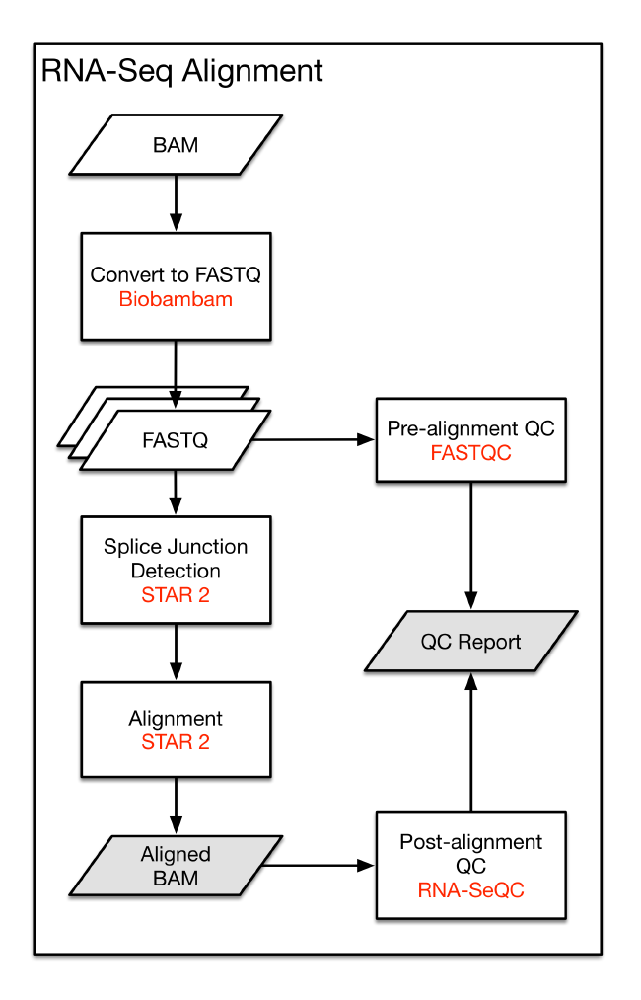

# mRNA Analysis Pipeline

## Introduction
The GDC mRNA quantification analysis pipeline measures gene level expression in [HT-Seq](http://www-huber.embl.de/HTSeq/doc/overview.html) raw mapping count, Fragments per Kilobase of transcript per Million mapped reads (FPKM) and FPKM-UQ (upper quartile normalization).  These values are generated through this pipeline by first aligning reads to the GRCh38 [reference genome](https://gdc.cancer.gov/download-gdc-reference-files) and then by quantifying the mapped reads. To facilitate harmonization across samples, all RNA-Seq reads are treated as unstranded during analyses.    


## Data Processing Steps

### RNA-Seq Alignment Workflow
The mRNA Analysis pipeline begins with the [Alignment Workflow](/Data_Dictionary/viewer/#?view=table-definition-view&id=alignment_workflow), which is performed using a two-pass method with [STAR](http://labshare.cshl.edu/shares/gingeraslab/www-data/dobin/STAR/STAR.posix/doc/STARmanual.pdf). STAR aligns each [read group](/Data_Dictionary/viewer/#?view=table-definition-view&id=read_group) separately and then merges the resulting alignments into one. Following the methods used by the International Cancer Genome Consortium [ICGC](https://icgc.org/) ([github](https://github.com/akahles/icgc_rnaseq_align)), the two-pass method includes a splice junction detection step, which is used to generate the final alignment. This workflow outputs a BAM file, which contains both aligned and unaligned reads. Quality assessment is performed pre-alignment with [FASTQC](http://www.bioinformatics.babraham.ac.uk/projects/fastqc/) and post-alignment with [RNA-SeQC](https://www.broadinstitute.org/cancer/cga/rna-seqc) and [Picard Tools](http://broadinstitute.github.io/picard/).

[](images/gene-expression-quantification-pipeline.png "Click to see the full image.")

| I/O | Entity | Format |
|---|---|---|
| Input | [Submitted Unaligned Reads](/Data_Dictionary/viewer/#?view=table-definition-view&id=submitted_unaligned_reads) or [Submitted Aligned Reads](/Data_Dictionary/viewer/#?view=table-definition-view&id=submitted_aligned_reads) |  FASTQ or BAM |
| Output | [Aligned Reads](/Data_Dictionary/viewer/#?view=table-definition-view&id=aligned_reads) | BAM  |

### RNA-Seq Alignment Command Line Parameters

####STAR-2.4.2a

####ICGC STAR alignment pipeline

__For users with access to the ICGC pipeline:__

```Shell
python star_align.py \
--genomeDir <star_index_path> \
--FastqFileIn <input_fastq_path> \
--workDir <work_dir> \
--out <output_bam> \
--genomeFastaFiles <reference> \
--runThreadN 8 \
--outFilterMultimapScoreRange 1 \
--outFilterMultimapNmax 20 \
--outFilterMismatchNmax 10 \
--alignIntronMax 500000 \
--alignMatesGapMax 1000000 \
--sjdbScore 2 \
--limitBAMsortRAM 0 \
--alignSJDBoverhangMin 1 \
--genomeLoad NoSharedMemory \
--outFilterMatchNminOverLread 0.33 \
--outFilterScoreMinOverLread 0.33 \
--twopass1readsN -1 \
--sjdbOverhang 100 \
--outSAMstrandField intronMotif \
--outSAMunmapped Within
```

__For users without access to the ICGC pipeline:__

#### Step 1: Building the STAR index.*
```Shell
STAR
--runMode genomeGenerate
--genomeDir <star_index_path>
--genomeFastaFiles <reference>
--sjdbOverhang 100
--sjdbGTFfile <gencode.v22.annotation.gtf>
--runThreadN 8
```
\*These indices are available for download at the GDC Website and do not need to be built again.

#### Step 2: Alignment 1st Pass.
```Shell
STAR
--genomeDir <star_index_path>
--readFilesIn <fastq_left_1>,<fastq_left2>,... <fastq_right_1>,<fastq_right_2>,...
--runThreadN <runThreadN>
--outFilterMultimapScoreRange 1
--outFilterMultimapNmax 20
--outFilterMismatchNmax 10
--alignIntronMax 500000
--alignMatesGapMax 1000000
--sjdbScore 2
--alignSJDBoverhangMin 1
--genomeLoad NoSharedMemory
--readFilesCommand <bzcat|cat|zcat>
--outFilterMatchNminOverLread 0.33
--outFilterScoreMinOverLread 0.33
--sjdbOverhang 100
--outSAMstrandField intronMotif
--outSAMtype None
--outSAMmode None
```
#### Step 3: Intermediate Index Generation.
```Shell
STAR
--runMode genomeGenerate
--genomeDir <output_path>
--genomeFastaFiles <reference>
--sjdbOverhang 100
--runThreadN <runThreadN>
--sjdbFileChrStartEnd <SJ.out.tab from previous step>
```
#### Step 4: Alignment 2nd Pass.
```Shell
STAR
--genomeDir <output_path from previous step>
--readFilesIn <fastq_left_1>,<fastq_left2>,... <fastq_right_1>,<fastq_right_2>,...
--runThreadN <runThreadN>
--outFilterMultimapScoreRange 1
--outFilterMultimapNmax 20
--outFilterMismatchNmax 10
--alignIntronMax 500000
--alignMatesGapMax 1000000
--sjdbScore 2
--alignSJDBoverhangMin 1
--genomeLoad NoSharedMemory
--limitBAMsortRAM 0
--readFilesCommand <bzcat|cat|zcat>
--outFilterMatchNminOverLread 0.33
--outFilterScoreMinOverLread 0.33
--sjdbOverhang 100
--outSAMstrandField intronMotif
--outSAMattributes NH HI NM MD AS XS
--outSAMunmapped Within
--outSAMtype BAM SortedByCoordinate
--outSAMheaderHD @HD VN:1.4
--outSAMattrRGline <formatted RG line provided by wrapper>
```
### mRNA Expression Workflow
Following alignment, BAM files are processed through the [RNA Expression Workflow](/Data_Dictionary/viewer/#?view=table-definition-view&id=rna_expression_workflow).

First the BAM files are filtered for reads that were aligned to protein-coding genes using the [samtools](http://samtools.sourceforge.net) view function. The reads mapped to each protein-coding gene are enumerated using HT-Seq count. The number of reads mapped to each gene (raw count), gene length and the total number of reads mapped to protein-coding genes are then used to calculate normalized expression levels using FPKM and FPKM-UQ (upper quartile normalization). Expression values are provided in a tab-delimited format. [GENCODE v22](http://www.gencodegenes.org/releases/22.html) was used for gene annotation.

[](images/gene-expression-quantification-pipeline.png "Click to see the full image.")


| I/O | Entity | Format |
|---|---|---|
| Input | [Aligned Reads](/Data_Dictionary/viewer/#?view=table-definition-view&id=aligned_reads) |  BAM |
| Output | [Gene Expression (HTSeq count/ FPKM/ FPKM-UQ)](/Data_Dictionary/viewer/#?view=table-definition-view&id=gene_expression) | TXT  |

### mRNA Quantification Command Line Parameters

Samtools v1.1; HTSeq-0.6.1p1

```Shell
samtools view -F 4 <input.bam> |
htseq-count \
-m intersection-nonempty \
-i gene_id \
-r pos \
-s no \
-t gencode.v22.annotation.gtf

```

## File Access and Availability

To facilitate the use of harmonized data in user-created pipelines, RNA-Seq gene expression is accessible in the GDC Data Portal at several intermediate steps in the pipeline. Below is a description of each type of file available for download in the GDC Data Portal.   

| Type | Description | Format |
|---|---|---|
| RNA-Seq Alignment | RNA-Seq reads that have been aligned to the GRCh38 build. Reads that were not aligned are included to facilitate the availability of raw read sets.  |  BAM |
| Raw Read Counts | The number of reads aligned to each protein-coding gene, calculated by HT-Seq. |  TXT |
| FPKM | A normalized expression value that takes into account each protein-coding gene length and the number of reads mappable to all protein-coding genes. |  TXT |
| FPKM-UQ | A normalized raw read count in which gene expression values, in FPKM, are divided by the 75th percentile value. |  TXT |
