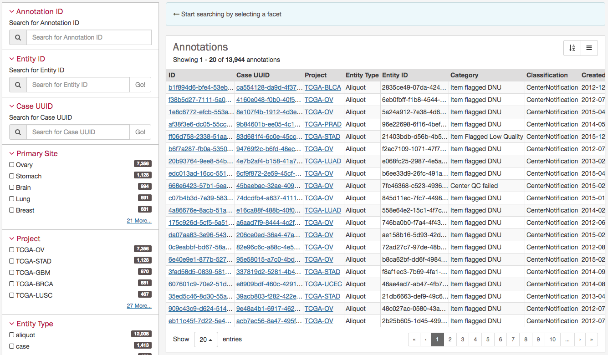
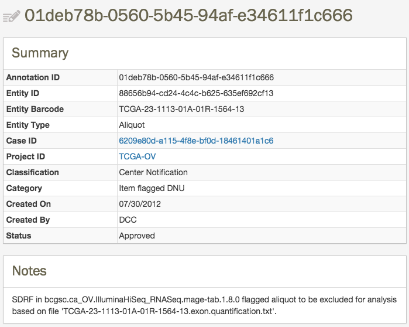

# Annotations

## Overview

Annotations are metadata, notes and caveats referring to cases, samples or files after curation.  

Annotations are important as they indicate that issues or caveats have been found with the cases, samples, or data after it has been submitted.

## Search

### Facets

The following facets are available to search for annotations:

* __Annotation ID__: Seach using annotation ID
* __Entity ID__: Seach using entity ID
* __Case UUID__: Seach using case UUID
* __Primary Site__: Tissue type of the cancer
* __Project__: See project section of the documentation
* __Entity Type__: Patient, Sample, Portion, Slide, Analyte, Aliquot
* __Annotation Category__: See link below
* __Annotation Created__: Search for annotations by date of creation
* __Annotation Classification__: See link below

### Annotation List

The list of annotations is displayed on the right side of the page, clicking on an Annotation ID will redirect the the annotation entity page

### Annotation Categories and Classification

For more details about categories and classifications please refer to the [TCGA Annotations page on NCI Wiki](https://wiki.nci.nih.gov/display/TCGA/Introduction+to+Annotations)

## Entity Page

The annotation entity page provides more details about a specific annotation. It is available by clicking on an Annotation ID somewhere on the portal.

