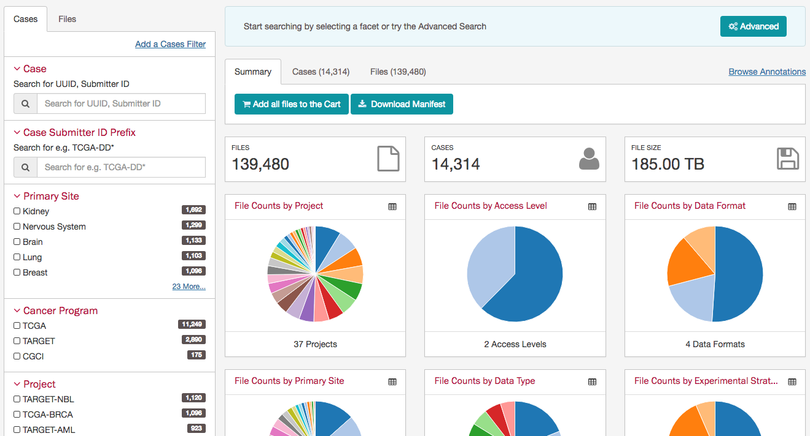
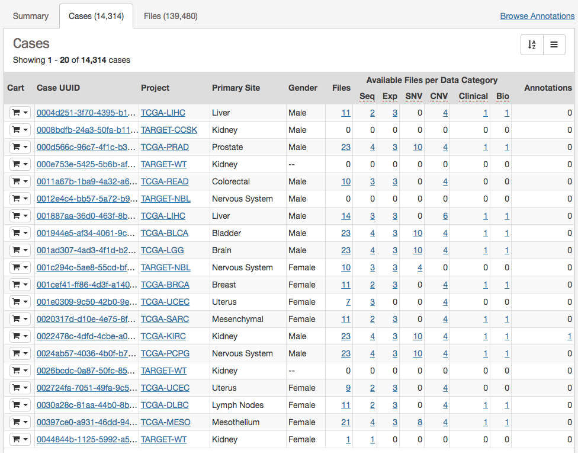
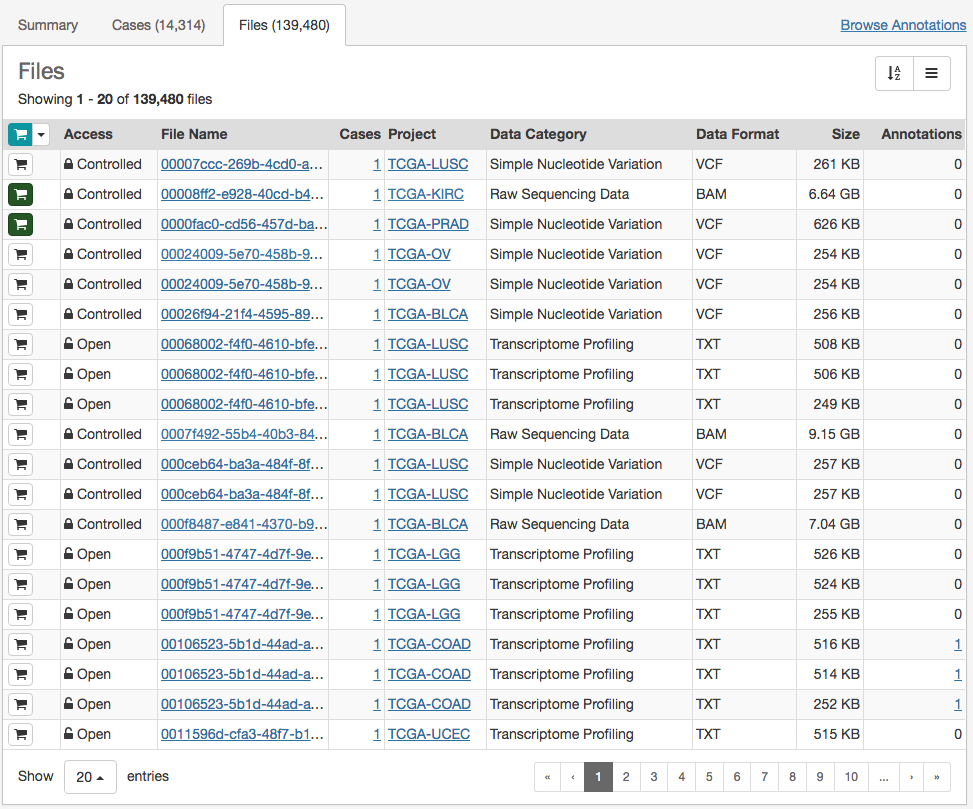
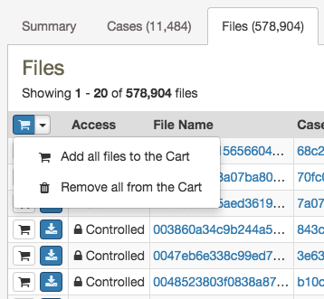
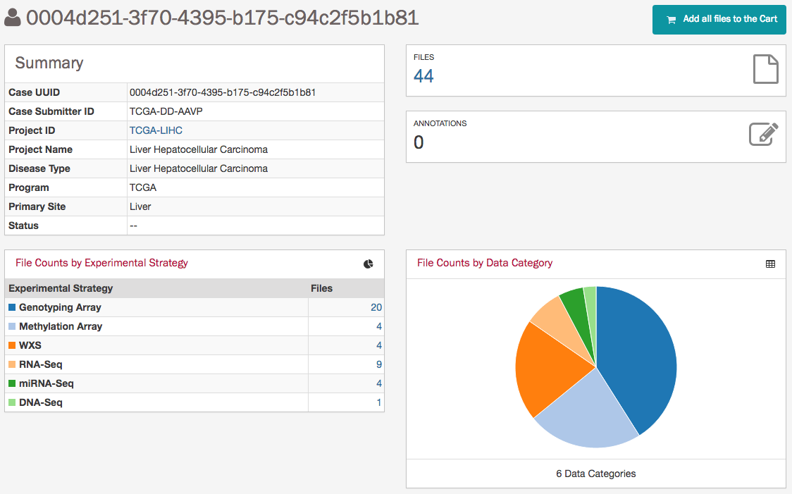
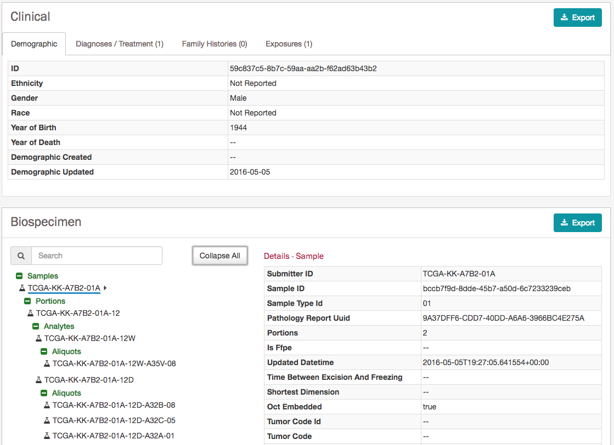
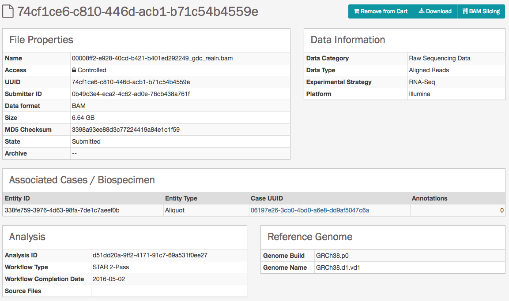

# Data

## Overview

The data view is the entry point to data searching on the GDC Data Portal, it provides access to all main features of the portal

The Data view is the main section used on the GDC Data Portal to search for data.

This view focuses on the number of data files available at GDC. Selecting items from the Cases and Files facet will reduce the numbers of files displayed to those files which have all the selected properties. Note that in this view, when a choice is selected (for example, Copy Number Variation), other facets will change to hide properties that are incompatible with the selected choice (for example, when Copy Number Variation is selected in the Files: Data Type facet, only data subtypes relevant to CNV are visible in the Files: Data Subtype facet).

## Cases and Files Search

### Facets
Two types of facets are available, _'Cases'_ and _'Files'_ facets.

By default, the following __Cases__ facets are available:

* __Case__: Search for cases using barcode or UUID.
* __Primary Site__: Originating or primary anatomic site of the cancer under investigation or review.
* __Cancer Program__: Programs are overarching activities meant to fulfill a broad scientific objective.  As mentioned above, Projects fulfill more specific requirements within a Program.
* __Project__: See project section of the documentation.
* __Disease Type__: Type of cancer studied in the project.
* __Gender__: Female or Male.
* __Age at diagnosis__: Patient age at the primary diagnosis.
* __Vital Status__: Indicate whether the patient was living or deceased at the date of last contact (Alive or Dead).
* __Days to death__: Number of days between primary diagnosis and death of the patient.
* __Race__: Each of the major divisions of humankind, having distinct physical characteristics.
* __Ethnicity__: Ethnicity is a socially defined category of people who identify with each other based on common ancestral, social, cultural or national experience.

By default, the following __Files__ facets are available:

* __File__: Search foe files using filename or ID
* __Data Category__: Data category of the file.
* __Data Type__: Kind of data contained in the file. Note that each of these data types may have subtypes, and that the numbers given in the table reflect the numbers of latest files for all subtypes of that data type.
* __Experimental Strategy__: This describes NGS sequencing strategies or microarray technological platforms/array types and other experimental assays.
* __Data Format__: Format of the data.
* __Platform__: Technological platform from which experimental data was produced.
* __Access Level__: Indicate whether data is open or controlled access.
* __Data Submitter__: Research center from where data was produced.
* __File Status__: Indicate status of data file, possible values: live, redacted etc.
* __Tags__: Short keyword or phrase assigned to data file to describe any perspective of the data file to facilitate data search.

### Summary

The summary tab displays a high-level view of the data currently being filtered.

On top of the page a button is available to "Add all files to the Cart" corresponding to currently filtered files.

Multiple pie charts and tables are available to provide a visual and interactive representation of data available on the GDC Data Portal.
Clicking on a specific slice of a table filter add the corresponding slice to currently applied filters.

### Cases

The Cases tab provides a list of all cases available on the GDC Data Portal. As with other sections of the portal, results can be filtered down via facets. Looking at the query field on top of the page is the best way to easily identify if a filter is currently being applied.

Clicking on any of the numbers in the table will apply this parameter to the filter currently being applied.

From this tab, clicking on the shopping cart will add all files related to this case to the cart.

### Files

The Files tab provides a list of all cases available on the GDC Data Portal. As with other sections of the portal, results can be filtered down via facets. Looking at the query field on top of the page is the best way to easily identify if a filter is currently being applied.

Three actions are available from this tab.

In the table header clicking on the shopping cart will give user the option to have all files matching current filter to be either added or removed from the cart.

Alternatively, for each row user can:

* Add the individual file to the cart
* Download the file directly

## Advanced

The _'Advanced'_ button redirects to the advanced query page; this feature is detailed in the [Advanced Search](Advanced_Search.md) section of the documentation.

## Case Entity Page

The Case Entity page displays case details including the project and disease information, data files that are available for that case, and the experimental strategies employed.

A button is available, on the top-right corner of the page to add all files associated to this case to the cart.

The Case Entity page also provides direct access to the Clinical information about that case, and the Biospecimen file associated with the samples collected from that case (if present).  These files can be downloaded using the links in this view.

## File Entity Page

Clicking on a filename on the GDC Data Portal redirects to a dedicated page providing additional details about the file.

From there the file can be added to cart, downloaded directly, or if the file is a BAM, just a slice can be downloaded.

More details about the file itself are provided in the upper section of the page.

In the lower section of the screen, the following tables provide more details about the file and its characteristics:

* __Associated Cases / Biospecimen__: Relation between this file and its case as well as between this file and any other file is also available in this page.
* __Workflow__: TO BE COMPLETED
* __Read Groups__: TO BE COMPLETED
* __Metadata Files__: TO BE COMPLETED
* __Downstream Analysis Files__: TO BE COMPLETED

If the file was originally produced as part of an archive containing many other files, the archive ID is displayed and, if selected, the user will see a _'Files'_ view containing all other files in that archive.

If the file was part of a MAGE-TAB archive, the whole archive can be downloaded from the file details page.  BAI sequence data index files are related to sequence data BAM files and will be displayed if relevant.

