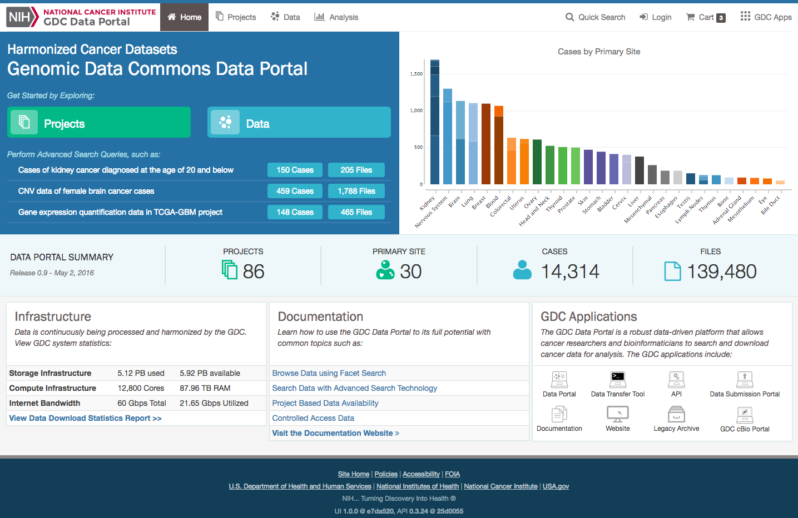
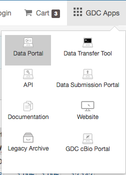

# Getting Started

## The GDC Data Portal: An Overview

The Genomic Data Commons (GDC) Data Portal provides users with web-based access to data from cancer genomics studies. Key GDC Data Portal features include:

*   Open, granular access to information about all datasets available in the GDC
*   Advanced search and visualization-assisted filtering of data files
*   Cart for collecting data files of interest
*   Authentication using eRA Commons credentials for access to controlled data files
*   Secure data download directly from the cart or using the [GDC Data Transfer Tool](https://gdc.cancer.gov/access-data/gdc-data-transfer-tool)

For more information about available datasets, see the [GDC Website](https://gdc.cancer.gov/about-data). This guide provides detailed information and instructions for using the GDC Data Portal.

## Accessing the GDC Data Portal

The GDC Data Portal is accessible using a web browser such as Chrome, Internet Explorer, and Firefox at the following URL:

[https://gdc-portal.nci.nih.gov](https://gdc-portal.nci.nih.gov)

The front page displays an overview of all available datasets:

## Navigation

### Views

The GDC Data Portal provides three sections (*Views*) for browsing available harmonized datasets:

* __Projects View__: Provides project-level information
* __Data View__: Provides access to granular clinical and biospecimen metadata and experimental data files
* __Annotations View__: Provides search and browsing features for annotations attached to various data and metadata entities

Each view provides a distinct representation of the same underlying set of GDC data and metadata. The GDC also provides access to certain unharmonized data files generated by GDC-hosted projects. These files and their associated metadata are not represented in the views above; instead they can be found in the __GDC Legacy Archive__.

Projects and Data views can be accessed from the GDC Data Portal front page and from the toolbar (see below). Annotations view is accessible from [Data view](Data.md). A link to the GDC Legacy Archive is available in the GDC Apps menu (see below).

### Toolbar

The toolbar available at the top of all pages in the GDC Data Portal provides convenient navigation links and access to authentication and quick search.

The left portion of this toolbar provides access to the front page, the Project and Data views, and a link to data analysis resources:

The right portion of this toolbar provides access to quick search, [authentication functions](Authentication.md), the [cart](Cart.md), and the GDC Apps menu:

The GDC Apps menu provides links to all resources provided by the GDC, including the [GDC Legacy Archive](Legacy_Archive.md).

## Filtering and Searching

The GDC Data Portal offers three different means of searching and filtering the available data:

* __Faceted Navigation__: Facets on the left of _'Projects'_ & _'Data'_ views allow users to apply filters based on various properties of the data, such as project name, disease name and stage, age, and various data formats and categories. Custom facets can be added by the user to expand the GDC Data Portal's filtering capabilities.
* __Advanced Search__: Allows users to construct complex queries using a custom query language and auto-complete suggestions.
* __Quick Search__: Search by UUID or submitter ID for quick access to specific records.
