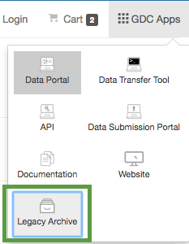
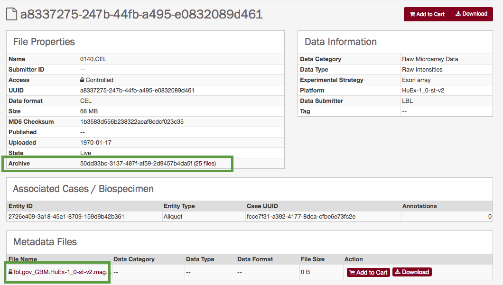

# Legacy Archive

## Overview

A section of the GDC Data Portal is dedicated to host legacy data.

The legacy data is the original data that uses the old genome build hg19 as produced by the original submitter. The legacy data is not actively being updated in any way. Users should migrate to the harmonized data ([GDC Data Portal] (Getting_Started.md)).

This GDC Legacy Archive can be accessed from the homepage of the GDC Data Portal as well as from the "GDC Apps" menu.

The GDC Legacy Archive contains a limited set of features of the GDC Data Portal: 

* __Facet search__: Ability to look for legacy files or legacy annotations based on case, file and annotation facets.
* __File and Annotation tables__: List of all the legacy files and list of all the legacy annotations.
* __File and Annotation entity pages__: Information page for each legacy file and annotation.
* __Cart__:  Both the GDC Legacy Archive and the GDC Data Portal are independant and have their own separate cart.

### File Entity Page

The file entity page is described here: [File Entity Page](Data.md#file-entity-page)

However a legacy file might provide additional information as described below.

#### Archive

If the file was originally produced as part of an archive containing many other files, the archive information (Archive ID and number of files in the archive) is displayed in the file properties and, if selected, the user will see a _'Files'_ view containing all other files in that archive.

#### Mage-Tab

If the file was part of a MAGE-TAB archive, the whole archive can be downloaded from the file details page in Metadata Files section. 

