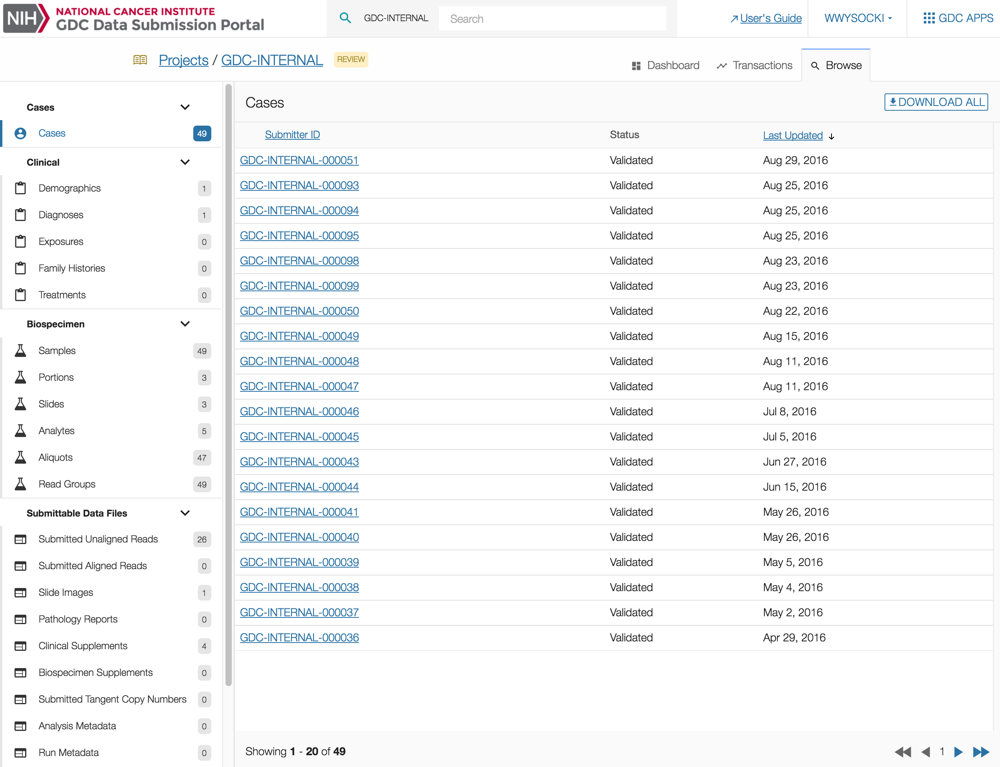
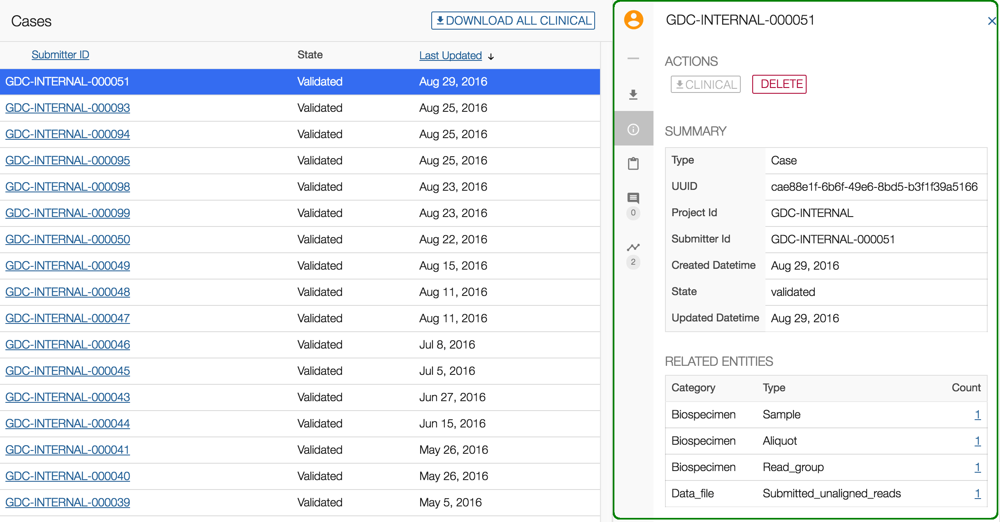

# Browse Data

## Overview

The _"Browse"_ menu provides access to all of a project's content. Most content is driven by the GDC Data Dictionary and the interface is dynamically generated to accommodate the content.

Please refer to the [GDC Data Dictionary Viewer](../../Data_Dictionary/viewer.md) for specific details about dictionary-generated fields, columns, and filters.

## Main Interface Elements

### Filters

A wide set of filters are available for the user to select the type of entity to be displayed. These filters are dynamically created based on the [GDC Data Dictionary](../../Data_Dictionary/index.md).

Current filters are:

|Filter|Description|
| --- | --- |
| __Cases__ | Display all `cases` associated with the project. |
| __Clinical Entities__ | Display all Clinical data uploaded to the project workspace. This is divided into subgroups including `demographics`, `diagnoses`, `exposures`, `family histories`, and `treatments`. |
| __Biospecimen Data__ | Display all Biospecimen data uploaded to the project workspace. This is divided into subgroups including `samples`, `portions`, `analytes`, `aliquots`, and `read groups`. |
| __Submittable Data Files__ | Displays all data files that have been registered with the project. This includes files that have been uploaded and those that have been registered but not uploaded yet. This category is divided into groups by file type. |
| __Annotations__ | Lists all annotations associated with the project. An annotation provides an explanatory comment associated with data in the project. |

### List View

The list view is a paginated list of all entities corresponding to the selected filter.

On the top-right section of the screen, the user can download data about all entities associated with the selected filter.

* For the case filter, it will download all Clinical data.
* For all other filters, it will download the corresponding metadata (e.g., for the `demographic` filter, it will download all `demographic` data).

### Details Panel

Clicking on an entity will open the details panel. Data in this panel is broken down into multiple sections depending on the entity type. The main sections are:

* __Actions__: Actions that can be performed relating the entity. This includes downloading the metadata (JSON or TSV) or submittable data file pertaining to the entity and deleting the entity. See the [Deleting Entities](https://gdc-docs.nci.nih.gov/Data_Submission_Portal/Users_Guide/Data_Upload_UG/#deleting-submitted-entities) guide for more information.  
* __Summary__: A list of IDs and system properties associated with the entity.
* __Details__: Properties of the entity (not associated with cases).
* __Hierarchy__ or __Related Entities__: A list of associated entities.
* __Annotations__: A list of annotations associated with the entity.
* __Transactions__: A list of previous transactions that affect the entity.

The sections listed above can be navigated either by scrolling down or by clicking on the section icon on the left side of the details panel.

#### Related Entities

The Related Entities table lists all entities, grouped by type, related to the selected `case`. This section is only available at the `case` level.

This table contains the following columns:

* __Category__: category of the entity (Clinical, Biospecimen, submittable data file).
* __Type__: type of entity (based on Data Dictionary).
* __Count:__ number of occurrences of an entity associated with the `case`. Clicking on the count will open a window listing those entities within the Browse page.

#### Hierarchy

The hierarchy section is available for entities at any level (e.g., Clinical, Biospecimen, etc.), except for `case`. The user can use the hierarchy section to navigate through entities.

The hierarchy shows:

* The `case` associated with the entity.
* The __direct__ parents of the entity.
* The __direct__ children of the entity.

