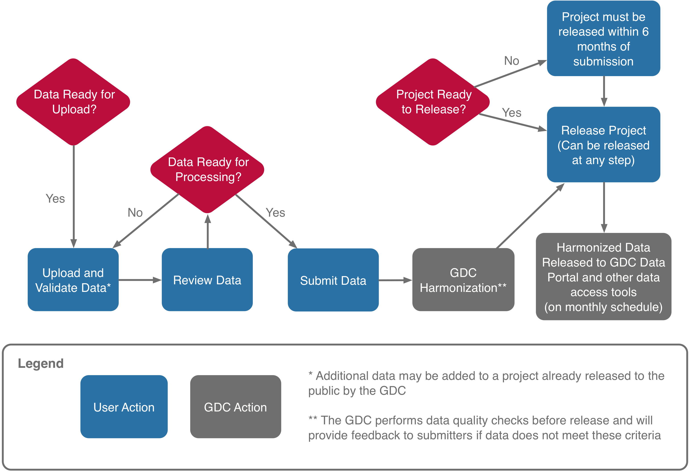

# Submission Workflow

## Overview

The workflow diagram below represents the data submission process that is implemented by the GDC Data Submission Portal. The submitter logs into the GDC Data Submission Portal, uploads data into the project workspace, and validates the data. When the data is ready for processing, the submitter reviews the data and submits it to the GDC. The GDC processes the data through the [GDC Harmonization Process](https://gdc.nci.nih.gov/submit-data/gdc-data-harmonization). Once harmonization has been completed, the submitter reviews the harmonized data and releases it to the GDC for access through the [GDC Data Portal](https://gdc-portal.nci.nih.gov/) and other [GDC Data Access Tools](https://gdc.nci.nih.gov/access-data/data-access-processes-and-tools).

### Upload and Validate Data
The submitter will upload clinical and biospecimen data to the project workspace using GDC templates that are available in the [GDC Data Dictionary](https://gdc-docs.nci.nih.gov/Data_Dictionary/). The GDC will validate the uploaded data against the GDC Data Dictionary. The submitter will upload experiment metadata to the workspace which will register experiment data for submission through the [Data Transfer Tool](https://gdc.nci.nih.gov/access-data/gdc-data-transfer-tool), a high performance client-based tool for uploading data. Once the submitter uploads the experiment metadata, the GDC Data Submission Portal will generate a manifest file that identifies the experiment data that will be uploaded. The submitter will use the manifest file to upload the experiment data through the Data Transfer Tool.

At this point, the data is not yet submitted to the GDC.

### Review and Submit Data
When data in the project workspace is ready for processing, the submitter must submit the data to the GDC for processing to occur through the [GDC Data Harmonization Pipeline](https://gdc.nci.nih.gov/submit-data/gdc-data-harmonization). Submitting data to the GDC will initiate the GDC Data Harmonization process.

During harmonization, there are two primary actions that should be performed:

* Review the Project: When a submitter reviews the project, the project is locked to prevent upload of new data. During this process, the submitter should verify that the data is ready for processing. If, during the review process, the submitter thinks the data is not ready for processing, the submitter can re-open the project. This allows the submitter to upload additional data to the project workspace.
* Submit the Data: After reviewing the project data, the submitter can submit the project to the GDC. This will trigger the harmonization process.

### Release Data
When the GDC harmonized data is ready and the project data is complete, the submitter or project owner will release the project. This will release harmonized data to the GDC for access through the [GDC Data Portal](https://gdc-portal.nci.nih.gov/) and other [GDC Data Access Tools](https://gdc.nci.nih.gov/access-data/data-access-processes-and-tools).

## Project Lifecycle

The lifecycle of a project in the GDC describes the workflow throughout the data submission process. The project lifecycle starts with the upload and validation of data into the project and ends with the release of the harmonized data to the GDC Data Portal and other GDC data access tools. Throughout the lifecycle, the project transitions through various states in which the project is open for uploading data, in review, and released. This lifecycle is continuous as new project data becomes available.

To summarize the project lifecycle and transitions to the various states of the project, the following operations can be performed by the submitter:

* The submitter can upload and validate data if the project __is not in__ REVIEW.
* The submitter can review the project if it __is__ OPEN. The GDC will prevent users from uploading any new data during the review period.
* The submitter can submit data to the GDC for processing, but cannot submit data to the Submission Portal, if the project __is in__ REVIEW.
* The submitter can release the project once the data has been submitted and processed. The GDC will release the harmonized data to the GDC Data Portal and other GDC Data Access Tools.

Note: "Submit to the GDC" and "Release" actions can be performed only if the user has release privileges.

### Project State
The diagram below demonstrates the transition of a project through the various states. Initially the project is OPEN for data upload and validation. When the data is uploaded and ready for review, the project state changes to REVIEW. During the REVIEW state, the project is locked so that additional data cannot be uploaded. When review has been completed and the submitter submits the data for GDC processing and the project state changes to SUBMITTED. If additional data changes are needed during the review period, the project can be re-opened and the state changes back to OPEN. When the data has been processed, the submitter can release the data and the project state changes to RELEASE. Once the data is released to the GDC for access through GDC data access tools, the project state changes back to OPEN for new data to be submitted to the project.

### Project Release State
When a submitter selects to release the data, the project state changes to RELEASE. If the submitter does not select to release the data within six months of data harmonization, the data is automatically released per the [NCI Genomic Data Sharing Policy](http://www.cancer.gov/grants-training/grants-management/nci-policies/genomic-data).

## File Status Lifecycle

This section describes states pertaining to experimental data files throughout the data submission process. An experimental data file could be genomic sequence file (such as a BAM or FASTQ) or a pathology slide image file. The file lifecycle starts when a submitter uploads metadata for a file to the Submission Portal. The act of uploading the file metadata registers a description of the file in the GDC. The submitter can then use the [GDC Data Transfer Tool](https://gdc.nci.nih.gov/access-data/gdc-data-transfer-tool), a high performance client-based tool, to upload the actual file. Throughout the lifecycle, the file status transitions through various states from when the file is initially registered through file processing and release.

