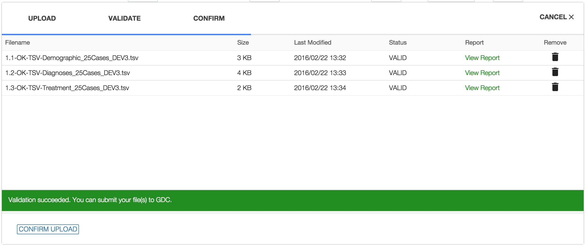
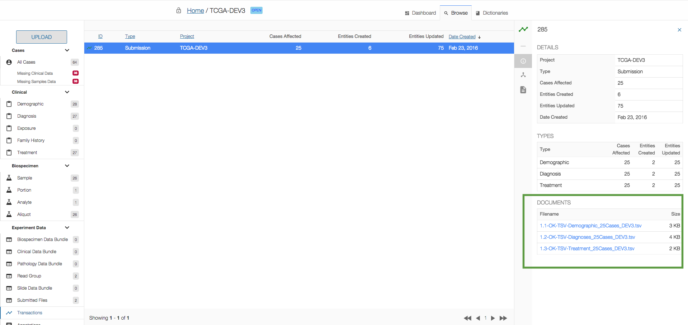

# Overview

GDC Data Submission process is detailed on the [GDC Website]( https://gdc.nci.nih.gov/submit-data/data-submission-processes-and-tools).
This chapter will focus on the upload and validation of the data.

# Files to upload

## File type
The GDC Data Submission Portal supports four types of files for upload to the GDC:

* __Clinical__: A case’s clinical data.
* __Biospecimen__: Metadata describing a tissue specimen collected from a case and other material derived from samples for analysis.
* __Experiment Data__: GDC's unit of submission (see below).
* __Annotations__: Observations associated with any entity, which can be useful for interpreting the data.

More details about the submission process, data files and file formats can be found on the GDC website at [Data Submission Processes and Tools] (https://gdc.nci.nih.gov/submit-data/data-submission-processes-and-tools) and [Data Types and File Formats] (https://gdc.nci.nih.gov/submit-data/gdc-data-types-and-file-formats).

### Focus on Experiment Data

GDC has developed a submission unit called a “data bundle”, which is a set of files with associated metadata.

Data bundle types are defined by what files are expected and what introspection is done for validation or linking to other GDC entities. Each data bundle will be validated via a bundle type and project specific schema, including a JavaScript Object Notation (JSON) data dictionary, relationship check and molecular data quality check. 

The experiment data supported by GDC is described in the [GDC Dictionary] (../../Dictionary/viewer.md). 

For example, Read Group is composed of:

* Read Group entity: will describe the experiment metadata (e.g. library strategy)
* Submitted File entity: will describe the file metadata (e.g. filename). 

The files (e.g. read_group.tsv and submitted\_file.tsv) describing these 2 entities must be uploaded to the GDC Submission Portal then the actual file (BAM file) must be uploaded through the GDC Data Transfer Tool.

The user should submit metadata for both entities via the GDC Submission Portal.

Following a data bundle upload, a __manifest__ can be obtained from the application and used to upload the actual files via the GDC Data Transfer Tool (DTT).

## File format

The GDC Data Submission Portal supports the following file formats for submission:

* JSON
* TSV

During the upload and validation process, files are converted by the GDC API into entities and inserted into the database, maintaining a file-agnostic backend.

The GDC Data Submission Portal offers the ability to download files in different formats. To do so the system converts database entities back to the requested file format.

# Upload and Validation Process

Data upload and validation is one of the main feature of the GDC Data Submission Portal. Using a submission wizard, submitters are guided through a three-stage process:

* __Upload Files__: Upload a file into the user's browser, at this point nothing is submitted to the project workspace.
* __Validate Files__: Send the file to the GDC backend to validate its content (see below).
* __Confirm Submission__: Submit validated file to the project workspace and produce a submission report.

The _'File Validation'_ stage acts as a safeguard against submitting incorrect files to the GDC Data Submission Portal. During the validation stage, the GDC API will validate content of submitted files against the project's dictionary to detect potential errors. Invalid files will be flagged and submission to GDC will be denied until corrections are made by the user. A validation error report provided by the system can be used to isolate and correct errors for resubmission.

# Step1. Prepare files with the data dictionary

The [GDC Dictionary] (../../Dictionary/viewer.md) describes the types of entities that can be uploaded to the GDC.

Go to the GDC Dictionary to download the template files to be used for the upload. The templates can be populated with data by the user and should result in a valid file (if validation rules detailed in the dictionary are met).

# Step 2. Upload Data Wizard

The GDC Data Submission Portal is equipped with a submission wizard window to guide you through the submission of the users files. When entering the submission process, this wizard window will provide an intuitive environment throughout the three stages of the submission:

* Upload Files.
* Validate Files.
* Confirm Submission.

## Upload Files

From the project dashboard, clicking on _'UPLOAD'_ will open the submission wizard.

Files can be added either by clicking on _'CHOOSE FILE(S)'_ or by using drag and drop.

## Validate Files

As soon as the first file is added, the wizard will move to the _'VALIDATE'_ section and the user can continue to add files.

Once all files have been added, clicking on _'VALIDATE'_ will check if files are valid for submission.

If the upload contains invalid files, the user will not be able to submit the data and those files will need to be either corrected and re-uploaded or removed from the submission. 

Files can be removed from the submission by clicking on the _'garbage'_ icon related to the file.

Click on _'View Report'_ to see the error report which provides details about why files failed validation. This report is detailed in the [Data Submission Reports](Reports.md) section of the documentation.

## Submit Files

Once all files are valid for submission, clicking on _'SUBMIT FILES'_ will submit the files to GDC.

**Note:** Submitted files are not released immediately. The user must select to release the files and GDC must validate and harmonize the submitted data for files to be released.

You can then click on _'CLICK HERE TO VIEW THE TRANSACTION'_ to be redirected to the transaction list page.

# Step 3. Upload Files through the DTT
For experiment data, you have to upload the actual file through the GDC Data Transfer Tool.

Once you uploaded the metadata through the Upload Data Wizard (e.g. read_group and submitted file metadata), you will be able to download the manifest from the transaction report.

====ADD SCREENSHOT - Wait for the submission UI update to add screenshot here of the transaction report ======

Use this manifest to upload your actual files to the GDC Data Transfer Tool. Please refer to the [GDC Data Transfer Tool's User Guide] (../Data_Transfer_Tool/Users_Guide/Getting_Started.md) for more information.

# Download previously submitted files

The transaction page, accessible through the Browse menu, list all previous transactions in the project. The user can download submitted files in the details section of the screen by selecting a particular transaction.

