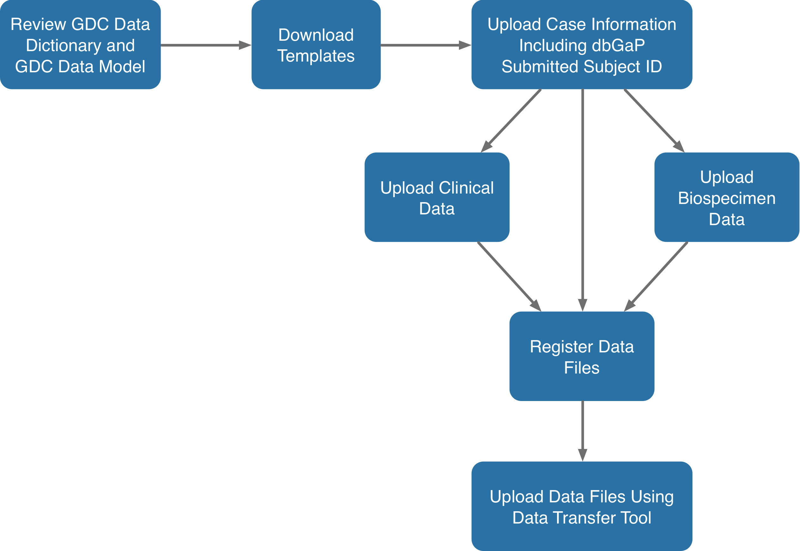
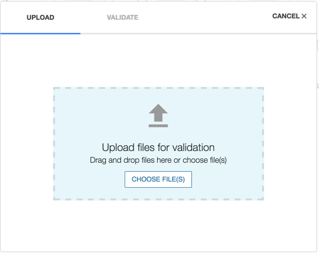
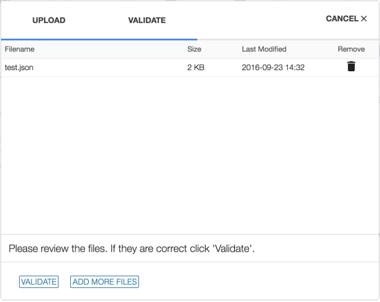
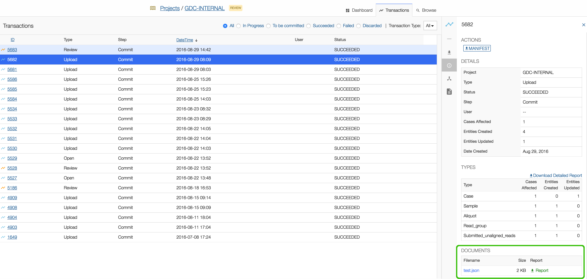

# Upload and Validate Data

## Overview

GDC Data Submission Portal users upload and validate clinical, biospecimen and file metadata using the portal, and then submit data files via the GDC Data Transfer Tool or the GDC API. The following diagram provides an overview of the process:

[](images/gdc-submission-portal-data-upload-workflow.png "Click to see the full image.")


## Supported File Formats

### Metadata Files

The GDC API accepts project metadata in JSON and TSV formats for the purpose of creating entities in the GDC Data Model. This includes clinical and biospecimen metadata such as tumor classification, age at diagnosis, sample type, and details about the available data files. Upon successful data submission and project release, this metadata is indexed and becomes available for queries by data users via the GDC Data Portal and the GDC API. Before submitting metadata files:

* Review the [GDC Data Model](../../Data/Data_Model/GDC_Data_Model.md) and the [GDC Data Dictionary](/Data_Dictionary/) to understand accepted metadata elements.
* Download metadata submission templates from the [GDC Data Dictionary](/Data_Dictionary/).


### Data Files

The GDC API accepts a variety of data files after their metadata has been registered: BAM and FASTQ files, clinical and biospecimen supplements, slide images, and other file types. Supported data file formats are listed on the [GDC website](https://gdc.cancer.gov/node/266/).


## Step 1: Prepare Metadata Files

The [GDC Data Model](../../Data/Data_Model/GDC_Data_Model.md) and the [GDC Data Dictionary](../../Data_Dictionary/viewer.md) describe the types of entities that can be uploaded to the GDC.

The user can go to the GDC Data Dictionary to __download the template metadata files__. The templates can be populated with data by the user and uploaded to the GDC Data Submission Portal. See each individual Data Dictionary entry for required properties and acceptable values.

### Data Relationships

All submitted entities must be linked to existing entities in the [GDC Data Model](../../Data/Data_Model/GDC_Data_Model.md). In order to create the relationship, the user must include a reference to the related entity using its Submitter ID or UUID.

For example, a Demographic entity describes a Case entity. The user is required to provide the case submitter ID or UUID in the Demographic metadata.

For a new submission project, cases are the first entities to be created, and linked to the project. Other entities are then created according to the [GDC Data Model](../../Data/Data_Model/GDC_Data_Model.md).

### Examples

#### Demographic


An example of a __demographic file__ that can be uploaded in TSV format is detailed below.

The structure of the file is as follows:

* Type = demographic
* Unique Keys = project\_id, submitter_id
* Links = cases.submitter_id
* Properties = ethnicity, gender, etc.

```tsv
type	project_id	submitter_id	cases.submitter_id	ethnicity	gender	race	year_of_birth
demographic	TCGA-DEV3	TCGA-DEV-3-CASE-000-D1	TCGA-DEV-3-CASE-000	hispanic or latino	male	white	1950
demographic	TCGA-DEV3	TCGA-DEV-3-CASE-001-D1	TCGA-DEV-3-CASE-001	not reported	female	white	1956
```

```json
[  
   {  
      "type":"demographic",
      "project_id":"TCGA-DEV3",
      "submitter_id":"TCGA-DEV-3-CASE-000-D1",
      "cases":[
        {
      "submitter_id":"TCGA-DEV-3-CASE-000"
        }
      ],
      "ethnicity":"hispanic or latino",
      "gender":"male",
      "race":"white",
      "year_of_birth":1950,
      "year_of_death":0
   },
   {  
      "type":"demographic",
      "project_id":"TCGA-DEV3",
      "submitter_id":"TCGA-DEV-3-CASE-001-D1",
      "cases":[
        {
      "submitter_id":"TCGA-DEV-3-CASE-001"
        }
      ],
      "ethnicity":"not reported",
      "gender":"female",
      "race":"white",
      "year_of_birth":1956
   }
]
```

#### Read Group Upload Example

An example of a __Read Group__ upload is detailed below. Uploading a read group requires two distinct types of metadata, which are divided into two files in this example.

The first file describes the read_group, which associates the submittable read file with information about the sequencing and library preparation.

File 1: read_group.tsv/json

```tsv
submitter_id	type	experiment_name	sequencing_center	sequencing_date	platform	instrument_model	library_strategy	flow_cell_barcode	library_selection	library_name	is_paired_end	read_length	read_group_name	aliquots.submitter_id
Blood-00001-aliquot_lane1_barcode	read_group	Resequencing	BI	2010-08-04	Illumina	Illumina HiSeq 2000	WXS	205DDABXX	Hybrid_Selection	Solexa-34688	true	75	205DD.3-2	Blood-00021-aliquot64
```
```json
{
    "submitter_id": "Blood-00001-aliquot_lane1_barcode",
    "type": "read_group",
    "experiment_name": "Resequencing",
    "sequencing_center": "BI",
    "sequencing_date": "2010-08-04",
    "platform": "Illumina",
    "instrument_model": "Illumina HiSeq 2000",
    "library_strategy": "WXS",
    "flow_cell_barcode": "205DDABXX",
    "library_selection": "Hybrid_Selection",
    "library_name": "Solexa-34688",
    "is_paired_end": true,
    "read_length": 75,
    "read_group_name": "205DD.3-2",
    "aliquots": [
        {
            "submitter_id": "Blood-00021-aliquot64"
        }
    ]   
}
```


The second describes the submitted_unaligned_reads.  This contains information about the file itself such as the file name, md5, and the data format.   

File 2: submitted\_unaligned_reads.tsv/json

```tsv
type	submitter_id	file_name	data_format	data_category	data_type	experimental_strategy	file_size	md5sum	read_groups.submitter_id
submitted_unaligned_reads	Blood-00001-aliquot_lane1_barcode.fastq	TestFile.fastq	FASTQ	Raw Sequencing Data	Unaligned Reads	WGS	61004	aa6e82d11ccd8452f813a15a6d84faf1	Blood-00001-aliquot_lane1_barcode
```


```json
{  
    "type": "submitted_unaligned_reads",
    "submitter_id": "Blood-00001-aliquot_lane1_barcode.fastq",
    "file_name": "TestFile.fastq",
    "data_format": "FASTQ",
    "data_category": "Raw Sequencing Data",
    "data_type": "Unaligned Reads",
    "experimental_strategy": "WGS",
    "file_size": 61004,
    "md5sum": "aa6e82d11ccd8452f813a15a6d84faf1",
    "read_groups": [
	{
            "submitter_id": "Blood-00001-aliquot_lane1_barcode"
	}
    ]
}
```


When the metadata files have been prepared (in TSV or JSON format), they can be uploaded with the Upload Data Wizard.

## Step 2: Upload Data Wizard

The GDC Data Submission Portal is equipped with a wizard window to guide you through the upload and validation of metadata files. There are three stages:

* __Upload Files__: Upload a file into the user's browser, at this point nothing is submitted to the project workspace.
* __Validate Files__: Send a file to the GDC backend to validate its content (see below).
* __Commit Upload__: Submit a validated file to the project workspace.

The _'File Validation'_ stage acts as a safeguard against submitting incorrect files to the GDC Data Submission Portal. During the validation stage, the GDC API will validate the content of uploaded metadata files against the Data Dictionary to detect potential errors. Invalid metadata files will not be processed and must be corrected by the user and re-uploaded before being accepted. A validation error report provided by the system can be used to isolate and correct errors.

### Upload Files

Choosing _'UPLOAD'_ from the project dashboard (panel 1) will open the submission wizard.

[](images/GDC_Submission_Wizard_Upload_2.png "Click to see the full image.")

Files can be added either by clicking on _'CHOOSE FILE(S)'_ or by using drag and drop.

### Validate Files

When the first file is added, the wizard will move to the _'VALIDATE'_ section and the user can continue to add files.

[](images/GDC_Submission_Portal_Validate.png "Click to see the full image.")

When all files have been added, clicking on _'VALIDATE'_ will check if the files are valid for submission.

If the upload contains valid files, a message will pop up when it is finished validating.  The upload then appears in the latest transactions panel with the option to "COMMIT" or "DISCARD" the data.  

If the upload contains invalid files, a message will pop up and the user will not be able to submit the data. Invalid files will need to be either corrected and re-uploaded or removed from the submission.

Files can be removed from the submission by clicking on the _'garbage can'_ icon next to the file.

### Asynchronous Transactions

Biospecimen or clinical metadata files that were uploaded through the Submission Portal are first validated without making changes to the project. See the entry in the [API Submission Guide](../../API/Users_Guide/Submission/#asynchronous-transactions) for more details. Validated files that not been committed yet can be seen in the [Transactions](Transactions.md) tab. Metadata contained in these files can be committed (applied) to the project or discarded using the two buttons on the right side of each transaction.

[](images/GDC_Submission_CommitDiscard.png "Click to see the full image.")

## Step 3: GDC Data Transfer Tool

The GDC Data Transfer Tool is used to upload submittable data files such as BAM and FASTQ files, slide images, and clinical and biospecimen supplement files.

After the user uploads metadata through the Upload Data Wizard (e.g., read_group and submitted file metadata), the manifest will be available for download from the transaction report.

**Note:** You can also download the manifest from the "Submittable Data Files" section of the Browse menu.

[](images/GDC_Submission_Transactions_Get_Manifest_2.png "Click to see the full image.")

Users can use this manifest to upload their data files with the GDC Data Transfer Tool. Please refer to the [GDC Data Transfer Tool's User Guide](../../Data_Transfer_Tool/Users_Guide/Getting_Started.md) for more information.

## Download Previously Uploaded Files

The [transaction](Transactions.md) page lists all previous transactions in the project. The user can download files uploaded to the GDC workspace in the details section of the screen by selecting one transaction and scrolling to the "DOCUMENTS" section.

[](images/GDC_Submission_Transactions_Original_Files_2.png "Click to see the full image.")
