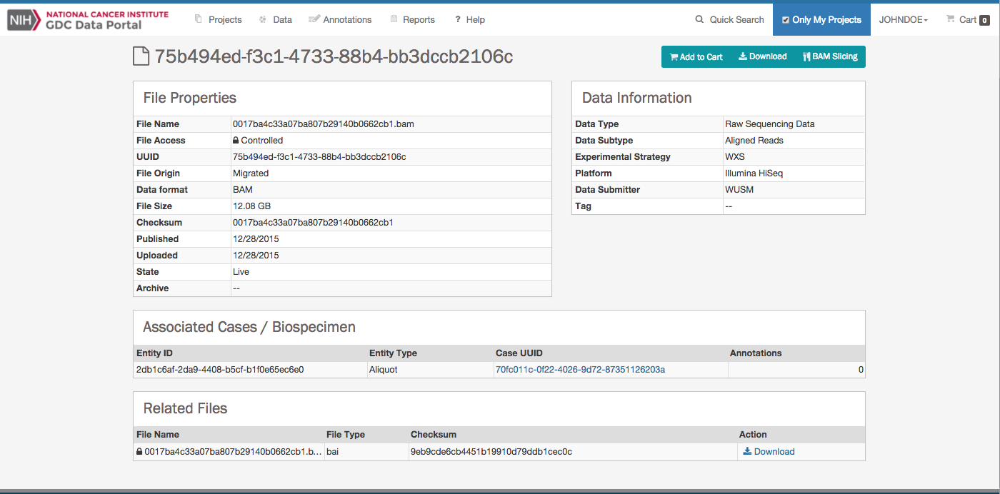
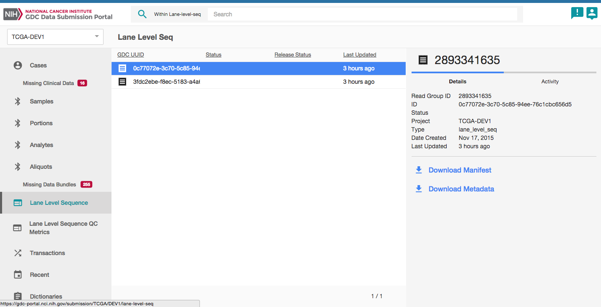

The GDC Data Transfer Tool is intended to be used in conjunction with the [GDC Data Portal](https://gdc-portal.nci.nih.gov) and the [GDC Data Submission Portal](https://gdc-portal.nci.nih.gov/submission/) to transfer data to or from the GDC. First, the GDC Data Portal&#39;s interface is used to generate a manifest file or obtain UUID(s) and (for controlled data) an authentication token. The GDC Data Transfer Tool is then used to transfer the data files listed in the manifest file or identified by UUID(s).

## Obtaining a Manifest File for Data Download

The GDC Data Transfer Tool supports downloading multiple files listed in a GDC manifest file. Manifest files can be generated and downloaded directly from the GDC Data Portal:

First, select the data files of interest. Click the *Cart* button in the row corresponding to the file desired. The button will turn green to indicate that the file has been selected.

Once all files of interest have been selected, click on the *Cart* button in the upper right-hand corner. This will bring up the cart page, which provides an overview of all currently selected files. This list of files can be downloaded as a manifest file by clicking on the blue *Download Manifest* button.

**GDC Data Portal: Cart Page**

## Obtaining UUIDs for Data Download

A manifest file is not required to download files from GDC. The GDC Data Transfer Tool will accept file UUID(s) instead of a manifest file for downloading individual data files. To obtain a data file's UUID from the GDC Data Portal, click the file name to find its detail page including its GDC UUID.

**GDC Data Portal: Detailed File Page**

## Obtaining a Manifest File for Data Upload

The GDC Data Transfer Tool supports uploading multiple files listed in a GDC manifest file. A manifest file for a data bundle can be generated using the GDC Data Submission Portal.

To obtain a manifest file, first select a project from the dropdown menu in the top left corner of the GDC Data Submission Portal:

**GDC Data Submission Portal: Select Project of Interest**

Select a type of Data Bundle on the left; here we selected the *Lane Level Sequence* bundle type. In the middle pane you will see a list of data bundles in the project. Select a data bundle to be uploaded, and download the corresponding manifest file by clicking the link on the right:

**GDC Data Submission Portal: Detailed bundle page**

## Obtaining an Authentication Token

The GDC Data Transfer Tool requires an authentication token to upload data to GDC and to download controlled data. Tokens can be generated and downloaded directly from the GDC Data Portal.

To generate a token, first log in to the GDC Data Portal by clicking the *Login* button in the top right corner of the page. This will redirect to the eRA Commons login page. After successful authentication, the GDC Data Portal will display the username in place of the *Login* button. Here, the user John Doe&nbsp;is logged in to the GDC Data Portal, indicated by the username JOHNDOE:

**GDC Data Portal Home Screen after Login**

Clicking the username will open a drop-down menu. Select *Download Token* from the menu to generate an authentication token.

**GDC Data Portal User Dropdown Menu**

**NOTE:** The authentication token should be kept in a secure location, as it allows access to all data accessible by the associated user.
