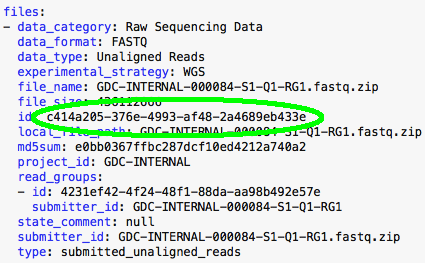
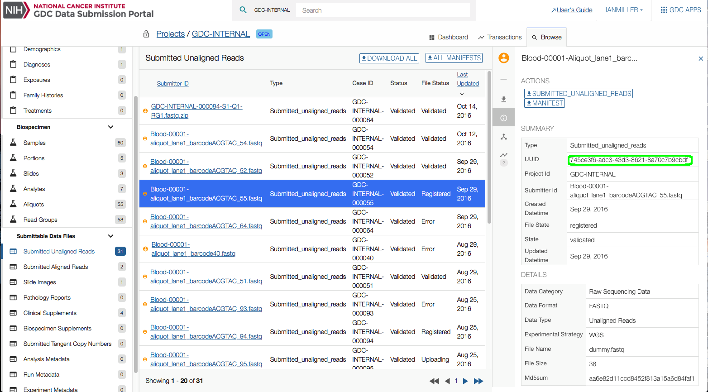
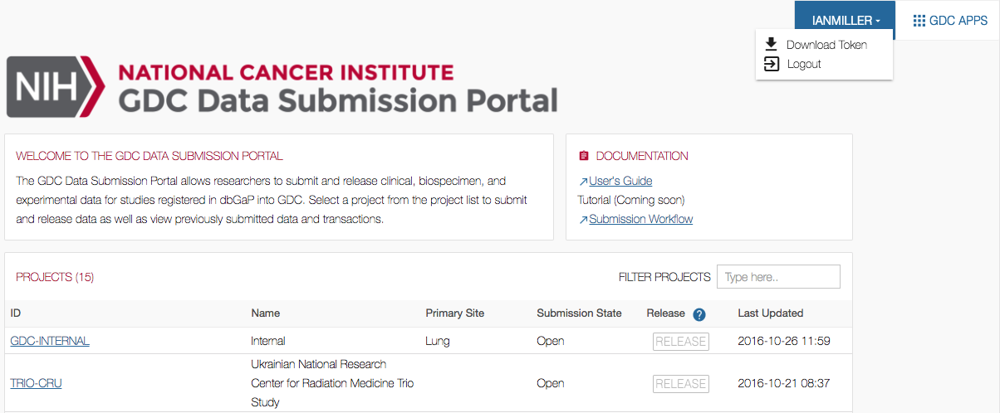

#Preparing for Data Downloads and Uploads

## Overview

The GDC Data Transfer Tool is intended to be used in conjunction with the [GDC Data Portal](https://gdc-portal.nci.nih.gov) and the [GDC Data Submission Portal](https://gdc-portal.nci.nih.gov/submission/) to transfer data to or from the GDC. First, the GDC Data Portal&#39;s interface is used to generate a manifest file or obtain UUID(s) and (for Controlled-Access Data) an authentication token. The GDC Data Transfer Tool is then used to transfer the data files listed in the manifest file or identified by UUID(s).

##Downloads
### Obtaining a Manifest File for Data Download

The GDC Data Transfer Tool supports downloading multiple files listed in a GDC manifest file. Manifest files can be generated and downloaded directly from the GDC Data Portal:

First, select the data files of interest. Click the *Cart* button in the row corresponding to the file desired. The button will turn green to indicate that the file has been selected.


Once all files of interest have been selected, click on the *Cart* button in the upper right-hand corner. This will bring up the cart page, which provides an overview of all currently selected files. This list of files can be downloaded as a manifest file by clicking on the green *Download* button and selecting *Manifest* from the drop down.


### Obtaining UUIDs for Data Download

A manifest file is not required to download files from GDC. The GDC Data Transfer Tool will accept file UUID(s) instead of a manifest file for downloading individual data files. To obtain a data file's UUID from the GDC Data Portal, click the file name to find its detail page including its GDC UUID.


### Obtaining an Authentication Token for Data Downloads

The GDC Data Transfer Tool requires an authentication token to download from GDC data portal to download Controlled-Access Data. Tokens can be generated and downloaded directly from the GDC Data Portal.

To generate a token, first log in to the GDC Data Portal by clicking the *Login* button in the top right corner of the page. This will redirect to the eRA Commons login page. After successful authentication, the GDC Data Portal will display the username in place of the *Login* button. Here, the user Ian Miller is logged in to the GDC Data Portal, indicated by the username IANMILLER.

Clicking the username will open a drop-down menu. Select *Download Token* from the menu to generate an authentication token.


<!---**GDC Data Portal User Dropdown Menu**--->

**NOTE:** The authentication token should be kept in a secure location, as it allows access to all data accessible by the associated user.

##Uploads
### Obtaining a Manifest File for Data Uploads
Multiple data file uploads are supported by the GDC Data Transfer Tool via a manifest file. Manifest files can be generated and downloaded directly from the GDC Submission Portal.  A project's manifest file can be downloaded from the projects's dashboard.  


<!---**GDC Submission Portal Manifest Download**--->

**NOTE:** To download a project's manifest file click on the _Download Manifest_ button located on the home page of the project, just below the four status charts.  A manifest will be generated for the entire project or if previous files have already been upload only the files that remain to be uploaded.  

A manifest for individual files can also be downloaded from the transaction tab and browse tab pages of the submission portal's project.  More information on the process can be found under the Submission Portal's documentation section entitled [Step 4: GDC Data Transfer Tool](https://gdc-docs.nci.nih.gov/Data_Submission_Portal/Users_Guide/Upload_Data/#step-4-gdc-data-transfer-tool).

### Obtaining UUIDs for Data Uploads
A UUID can be used for data submission with the Data Transfer Tool.  The UUID for submittable data uploads can be obtained from the Submission Portal or from the API GraphQL endpoint.  In the Submission Portal the UUID for a data file can be found in the Manifest YAML file located in the _id:_ row located under the file size entry.   




 A second location to obtain a UUID in the Submission Portal is on the Browse Tab page. Under the Submittable Data Files section a UUID can be found by opening up the file's detail page. By clicking on the Submitter ID of the upload file a new window will display a Summary of the file's details, which contains the UUID.

  

###GraphQL

A UUID can be obtain from the API GraphQL endpoint.  An overview of what GraphQL and its uses is located on the API documentation page section [Querying Submitted Data Using GraphQL](https://gdc-docs.nci.nih.gov/API/Users_Guide/Submission/#querying-submitted-data-using-graphql)

The following example will query the endpoint to produce a UUID along with submitter_id, file_name, and project_id.

```GraphQl_Bare
{
  submitted_unaligned_reads (project_id: "GDC-INTERNAL", submitter_id: "Blood-00001-aliquot_lane1_barcode23.fastq") {
   id
   submitter_id
   file_name
   project_id
}
}
```
```Escaped_Json
{\n  submitted_unaligned_reads (project_id: \"GDC-INTERNAL\", submitter_id: \"Blood-00001-aliquot_lane1_barcode23.fastq\") {\n   id\n   submitter_id\n   file_name\n   project_id\n}\n}\n

```
```Query_json
{
        "query": "{\n \n  submitted_unaligned_reads (project_id: \"GDC-INTERNAL\", submitter_id: \"Blood-00001-aliquot_lane1_barcode23.fastq\") {\n    id\n    submitter_id\n    file_name\n    project_id\n}\n}",
        "variables": null
}
```
```Shell_command
export token=ALPHANUMERICTOKEN-01234567890+AlPhAnUmErIcToKeN=0123456789-ALPHANUMERICTOKEN-01234567890+AlPhAnUmErIcToKeN=0123456789-ALPHANUMERICTOKEN-01234567890+AlPhAnUmErIcToKeN=0123456789-ALPHANUMERICTOKEN-01234567890+AlPhAnUmErIcToKeN=0123456789-ALPHANUMERICTOKEN-01234567890+AlPhAnUmErIcToKeN=0123456789-ALPHANUMERICTOKEN-01234567890+AlPhAnUmErIcToKeN=0123456789-ALPHANUMERICTOKEN-01234567890+AlPhAnUmErIcToKeN=0123456789-ALPHANUMERICTOKEN-01234567890+AlPhAnUmErIcToKeN=0123456789-ALPHANUMERICTOKEN-01234567890+AlPhAnUmErIcToKeN=0123456789-ALPHANUMERICTOKEN-01234567890+AlPhAnUmErIcToKeN=0123456789-ALPHANUMERICTOKEN-01234567890+AlPhAnUmErIcToKeN=0123456789-ALPHANUMERICTOKEN-01234567890+AlPhAnUmErIcToKeN=0123456789-ALPHANUMERICTOKEN-01234567890+AlPhAnUmErIcToKeN=0123456789-ALPHANUMERICTOKEN-01234567890+AlPhAnUmErIcToKeN=0123456789-ALPHANUMERICTOKEN-01234567890+AlPhAnUmErIcToKeN=0123456789-ALPHANUMERICTOKEN-01234567890+AlPhAnUmErIcToKeN=0123456789-ALPHANUMERICTOKEN-01234567890+AlPhAnUmErIcToKeN=0123456789-ALPHANUMERICTOKEN-01234567890+AlPhAnUmErIcToKeN=0123456789-ALPHANUMERICTO
$ curl --request POST --header "X-Auth-Token: $token" 'https://gdc-api.nci.nih.gov/v0/submission/graphql' -d@data.json
```
```API_Response
{
  "data": {
    "submitted_unaligned_reads": [
      {
        "file_name": "dummy.fastq",
        "id": "616eab2f-791a-4641-8cd6-ee195a10a201",
        "project_id": "GDC-INTERNAL",
        "submitter_id": "Blood-00001-aliquot_lane1_barcode23.fastq"
      }
    ]
  }
```
### Obtaining an Authentication Token for Data Uploads
While biospecimen and clinical metadata may be uploaded via the GDC Data Submission Portal, file upload must be done using the Data Transfer Tool or API.  An authentication token is required for data upload and can be generated on the GDC Data Submission Portal.

To generate a token, first log in to the GDC Data Submission Portal by clicking the *Login* button in the top right corner of the page.  This will create a popup window that will redirect to the eRA Commons login page. After successful authentication, the GDC Submission Portal will display the username in place of the *Login* button. Here, the user Ian Miller is logged in to the GDC Submission Portal, indicated by the username IANMILLER.

Clicking the username will open a drop-down menu. Select *Download Token* from the menu to generate an authentication token.


<!---**GDC Submission Portal User Dropdown Menu**--->
