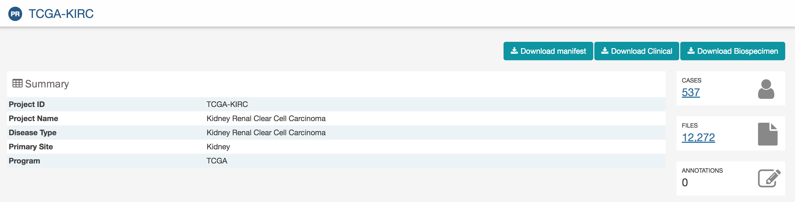
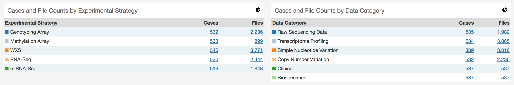
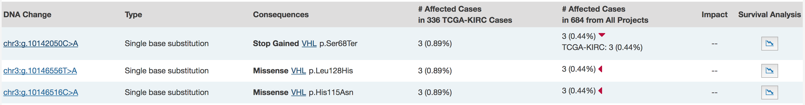
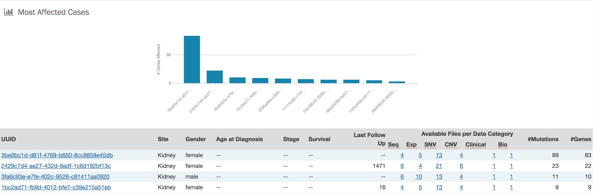

### ADD THIS TO THE END OF THE PROJECTS PAGE DOCUMENTATION

(New Features)

## Project Page

The Summary panel details the disease type associate with the project, along with that type's primary site and the number of cases, files, and annotations associated with the project.  Below the summary panel is a breakdown of the number of cases and files included in each experimental strategy and data category.  The pie chart icon at the top right of both of these panels will visually display this information in a pie chart.

## Most Frequently Mutated Genes

This bar graph and associated table displays the genes in which the most somatic mutations are observed. The table is dynamically generated based on the top mutated genes or the text that is entered into the search bar. , (XXXX DETAILS XXXXX) each gene row can be expanded to display the number of affected cases for each project.

* __Symbol:__ The symbol for the gene
* __Cytoband:__ The location of the mutation on the chromosome in terms of Giemsa-stained samples.
* __# Affected Cases:__ The number of affected cases for this project is displayed in the first column. The second column displays the number of affected cases across all projects and can be expanded for a project-level breakdown of affected cases by clicking on the red arrow. The number of affected cases is displayed as a ratio and percentage of the total number of cases on both levels.
* __# of Mutations:__ The number of somatic mutations detected in that gene (XXXX for the project, or across all projects XXX)
* __Survival Analysis:__ This displays an additional curve for the gene in the survival plot (mutated vs. unmutated)

### Survival Plot

The most frequently mutated genes section also displays a survival plot. Survival percentage is displayed as a function of time and is displayed for cases with a mutated form of a certain gene and cases without a mutation. Initially the project-wide survival is shown. Choosing the 'Survival Analysis' icon from the row of the gene table will display the survival plot for members of the project with unmutated vs. mutated allele of that gene.

## OncoGrid

An OncoGrid graphic is generated for each project and displayed on its entity page.  

[

### Interpreting OncoGrid

The OncoGrid is displayed as a grid with cells that are shaded different colors.  Each cell represents the state of the top 50 mutated genes in each case with each row representing a gene and each column representing a case. If a mutation is detected in a case's gene, that cell is shaded a color that represents the biological effect of the mutation. Two bar graphs that border the x and y-axis represent the frequency of mutations for each case and gene respectively. Clinical data and data type can also be represented in a grid below the main OncoGrid graphic.  

### OncoGrid Features

To facilitate readability and comparisons, drag-and-drop can be used to reorder the gene rows.  Double clicking a row in the "# Cases Affected" bar at the right side of the graphic will bring the user to the respective [Gene Entity](GeneEntity.md) page. Hovering over a cell will display information about the mutation such as its ID and biological consequence. Clicking on the cell will bring the user to the respective [Mutation Entity](MutationEntity.md) page.  

A tool bar at the top right of the graphic allows the user to export the data as a JSON object, PNG image, or SVG image.  Six buttons are also available in this toolbar:

* __Reload Grid:__ Sets all OncoGrid rows, columns, and zoom levels back to their initial positions
* __Cluster Data:__ Clusters the rows and columns to place mutated genes with the same cases and cases with the same mutated genes together
* __Toggle Heat Map View:__ View can be toggled between cells representing mutation consequences or number of mutations in each gene
* __Toggle Gridline:__ Toggles the presence of gridlines on the graphic
* __Toggle Crosshair:__ Toggles the crosshair tool, which allows for specific regions of the grid to be zoomed in
* __Full Screen:__ Displays the OncoGrid graphic in full-screen mode

## Most Frequent Mutations

This bar graph and associated table displays the distribution of mutations that are observed the most frequently in the project and the number of cases they affect.  

* __DNA Change:__ The specific nucleotide change, chromosome, and position of the mutation
* __Type:__ A general classification of the mutation. Includes: XXXX, XXXX, XXXX, and XXXX
* __Consequences:__ The biological consequences of each mutation
* __# Affected Cases:__ The number of affected cases for this project is displayed in the first column. The second column displays the number of affected cases across all projects and can be expanded for a project-level breakdown of affected cases by clicking on the red arrow. The number of affected cases is displayed as a ratio and percentage of the total number of cases on both levels.
* __Impact:__ The biological impact of each mutation.
* __Survival Analysis:__ This adds the mutation to the survival analysis (with mutation vs. not)

## Most Affected Cases

This bar graph and associated table displays the ten cases with the greatest number of somatic mutations in the project. The associated table associates the case and number of mutations with additional clinical data.

* __UUID:__ The Case UUID, which links to the case entity page
* __Site:__ The anatomical location affected by the project-associated disease
* __Gender:__ Text designations that identify gender. Gender is described as the assemblage of properties that distinguish people on the basis of their societal roles
* __Age at Diagnosis:__ Age at the time of diagnosis expressed in years
* __Stage:__ The extent of a cancer in the body. Staging is usually based on the size of the tumor, whether lymph nodes contain cancer, and whether the cancer has spread from the original site to other parts of the body. The accepted values for tumor_stage depend on the tumor site, type, and accepted staging system
* __Survival:__ Time from the initial diagnosis until death, expressed in days
* __Last Follow-up:__ Time from the initial diagnosis until the last recorded follow-up, displayed in days
* __SSM:__ The number of somatic single-base mutations identified in the case
* __CNSM:__ The number of copy-number somatic mutations identified in the case
* __Available Files per Data Category:__ Five columns displaying the number of files available in each of the five data categories
* __# Mutations:__ The number of somatic mutations found in the case
* __# Genes:__ The number of genes affected by the somatic mutations
