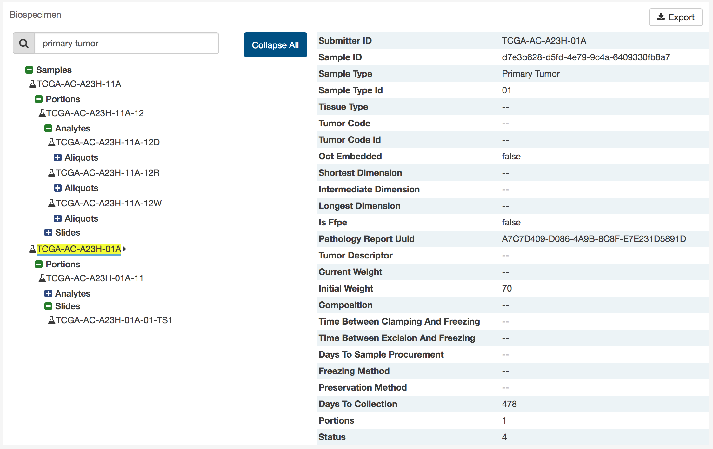

# Case Page

The case page displays case details including the project and disease information, data files that are available for that case, and the experimental strategies employed. A button in the top-right corner of the page allows the user to add all files associated with the case to the file cart.

## Clinical and Biospecimen Information

The page also provides clinical and biospecimen information about that case. Links to export clinical and biospecimen information in JSON format are provided.

For clinical records that support multiple records of the same type (Diagnoses, Family Histories, or Exposures), a UUID of the record is provided on the left hand side of the corresponding tab, allowing the user to select the entry of interest:

### Biospecimen Search

A search filter just below the biospecimen section can be used to find and filter biospecimen data. The wildcard search will highlight entities in the tree that match the characters typed. This will search both the case submitter ID, as well as the additional metadata for each entity. For example, searching 'Primary Tumor' will highlight samples that match that type.

## Most Frequent Mutations

The case page will also display the most frequent mutations in the case.  It is displayed as a bar graph that indicates the number of cases that share each mutation and in a tabular format below.  

The top of this section contains a plot of the most frequently mutated genes and a survival plot of all the cases within the specified project.  Hovering over each bar in the plot will show information about the number of cases affected.

A table is displayed below that lists information about each mutation including:

* __ID:__ A UUID Code for the mutation assigned by the GDC, when clicked will bring a user to the [Mutation Page](MutationEntity.md)
* __DNA Change:__ The chromosome and starting coordinates of the mutation are displayed along with the nucleotide differences between the reference genome and tumor sample.  
* __Type:__ A general classification of the mutation
* __Consequences:__ The effects the mutation has on the gene coding for a protein (i.e. synonymous, missense, non-coding transcript).  A link to the [Gene Page](GeneEntity.md) for the gene affected by the mutation is included
* __# Affected Cases in Project:__ The number of affected cases in the particular project
* __# Affected Cases in GDC:__ The number of affected cases, expressed as number across all projects. Choosing the arrow next to the percentage will expand the selection with a breakdown of each affected project.
* __Impact:__ A subjective classification of the severity of the variant consequence. The categories are:
  - __HIGH__: The variant is assumed to have high (disruptive) impact in the protein, probably causing protein truncation, loss of function or triggering nonsense mediated decay.
  - __MODERATE__: A non-disruptive variant that might change protein effectiveness.
  - __LOW__: Assumed to be mostly harmless or unlikely to change protein behavior.
