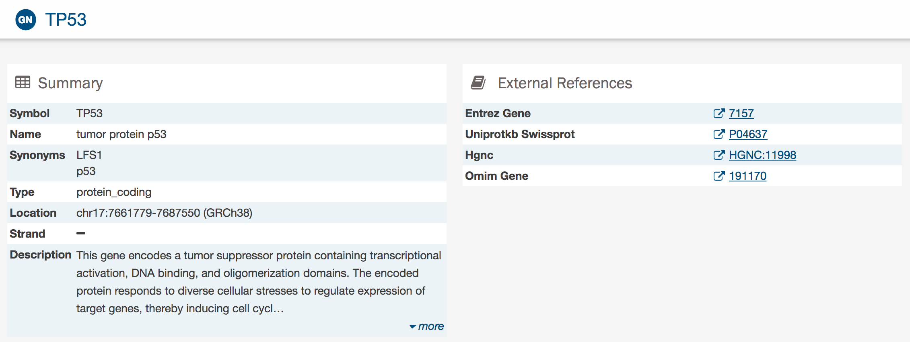
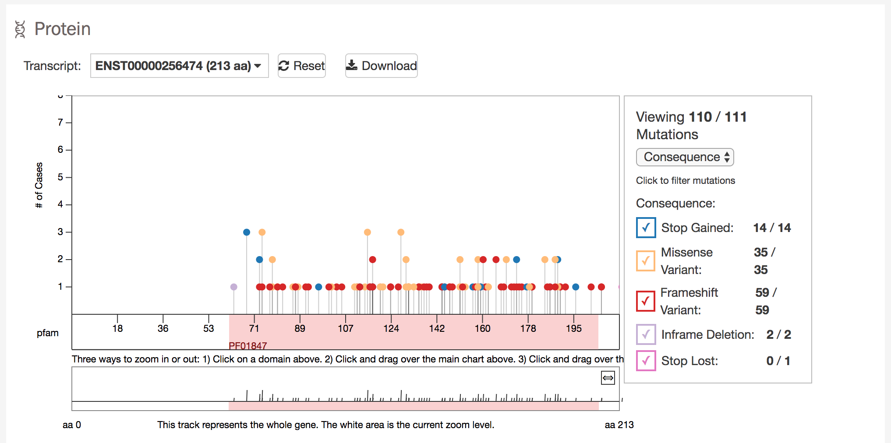

# Gene Summary Page

The Gene Summary Page describes each gene with mutation data featured at the GDC and provides results related to the analyses that are performed on these genes.  

## Summary

The summary section of the gene page contains the following information:

* __Symbol:__ The gene symbol
* __Name:__ Full name of the gene
* __Synonyms:__ Synonyms of the gene name or symbol, if available
* __Type:__ A broad classification of the gene
* __Location:__ The chromosome on which the gene is located and its coordinates
* __Strand:__ If the gene is located on the forward (+) or reverse (-) strand
* __Description:__ A description of gene function and downstream consequences of gene alteration.

## External References

A list with links that lead to external databases with additional information about each gene is displayed here. These external databases include: [Entrez](https://www.ncbi.nlm.nih.gov/gquery/), [Hugo Gene Nomenclature Committee](http://www.genenames.org/), [Online Mendelian Inheritance in Man](https://www.omim.org/), and [Uniprotkb SwissProt](http://www.uniprot.org/).

## Cancer Distribution

A table and bar graph displayed that shows how many cases are affected by mutations within the gene as a ratio and percentage. Each row/bar represents the number of cases for each project.

## Protein Viewer

Mutations and their frequency across cases are mapped to a graphical visualization of protein-coding regions with a lollipop plot. Pfam domains are highlighted along the x-axis to assign functionality to specific protein-coding regions. The bottom track represents a view of the full gene length. Different transcripts can be selected by using the drop-down menu above the plot.  

The panel to the right of the plot allows the plot to be filtered by mutation consequence or impact.  The plot will dynamically change as filters are applied.  Mutation consequence and impact is denoted in the plot by color.

The plot can be viewed at different zoom levels by clicking and dragging across the x-axis, clicking and dragging across the bottom track, or double clicking the pfam domain IDs. The `Reset` button can be used to bring the zoom level back to its original position. The plot can also be exported as a PNG image, SVG image or as JSON formatted text by choosing the `Download` button above the plot.

## Most Frequent Mutations

The 20 most frequent mutations in the gene are displayed as a bar graph that indicates the number of cases that share each mutation.  

A table is displayed below that lists information about each mutation including:

* __ID:__ A UUID Code for the mutation assigned by the GDC, when clicked will bring a user to the [Mutation Summary Page](MutationEntity.md)
* __DNA Change:__ The chromosome and starting coordinates of the mutation are displayed along with the nucleotide differences between the reference genome and tumor sample.  
* __Type:__ A general classification of the mutation
* __Consequences:__ The effects the mutation has on the gene coding for a protein (i.e. synonymous, missense, non-coding transcript).
* __# Affected Cases:__ The number of affected cases, expressed as number across all projects. Choosing the arrow next to the percentage will expand the selection with a breakdown of each affected project.
* __Impact:__ A subjective classification of the severity of the variant consequence. The categories are:
  - __HIGH__: The variant is assumed to have high (disruptive) impact in the protein, probably causing protein truncation, loss of function or triggering nonsense mediated decay.
  - __MODERATE__: A non-disruptive variant that might change protein effectiveness.
  - __LOW__: Assumed to be mostly harmless or unlikely to change protein behavior.
