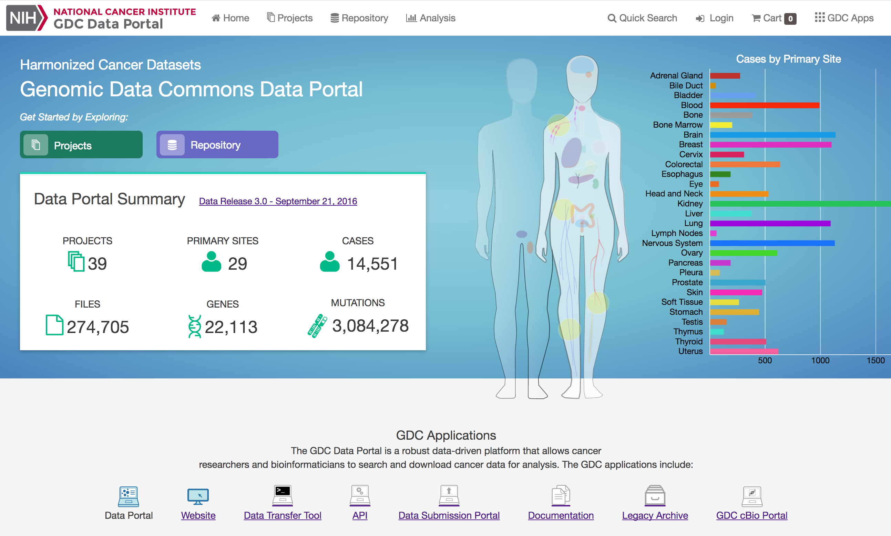

# GDC Visualization Suite, User Acceptance Testing, April 2017

This guide describes the new data visualization features that can be accessed at the GDC Data Portal. Visualization features include detailed descriptions of mutations, genes, and their frequency; graphical representation of mutation positions, and dynamic survival analysis plots. Additionally, new API endpoints are available for users to programmatically retrieve the data used to generate the visualization features.  

The mutation-based visualization features are derived from open-access MAF files that were produced by GDC variant-calling pipelines. The format of these MAF files was developed by and for the GDC and is outlined in the MAF Format documentation.

---

---

## GDC Portal Home Page

The GDC Portal home page is the entry way to accessing data in the Genomic Data Commons.  

The Genomic Data Commons can be queried by project or by primary site (i.e Brain). Data can be narrowed down in a few ways listed below.

* __Projects__: The projects link directs users to the Project List Page, which gives an overall summary of project-level information.

* __Repository__: The repository link allows users to see the data files available at the GDC and apply file/case filters to narrow down their search.

* __Human Outline__: The home page displays a human anatomical outline that can be used to refine their search. Choosing an associated organ will direct the user to a listing of all projects associated with that primary site. For example, clicking on the human brain will show only cases and projects associated with brain cancer (TCGA-GBM and TCGA-LGG).  The number of cases associated with each primary site is also displayed here and separated by project.

---
