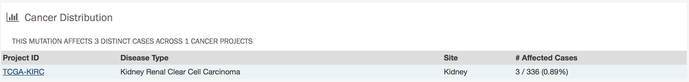

## Mutation Entity Page

The mutation entity page contains information about a particular mutation and how it affects the associated gene.

### Summary

* __ID:__ A unique identifier for the mutation
* __DNA Change:__ Denotes the chromosome number, position, and nucleotide change of the mutation
* __Type:__ A broad categorization of the mutation
* __Reference Genome Assembly:__ The reference genome in which the chromosomal position refers to
* __Allele in the Reference Assembly:__ The nucleotide(s) that compose the site in the reference assembly
* __Functional Impact:__ The biological effects of the mutation

#### External References

A separate panel contains links to information about the mutation in external databases. These databases include IntoGen, Cancer Hotspots, and XXXXX.

### Consequences

The consequences of each mutation are displayed in a table, which can be exported as a (XXXXX TSV or) JSON object. The fields that detail each mutation are listed below:

* __Gene:__ The symbol for the affected gene
* __AA Change:__ Details on the amino acid change, including compounds and position, if applicable
* __Consequence:__ The biological consequence of each mutation
* __Coding DNA Change:__ The specific nucleotide change and position of the mutation within the gene
* __Strand:__ If the gene is located on the forward or reverse strand
* __Transcript(s):__ The transcript(s) affected by the mutation. Each contains a link to the [Ensembl](https://www.ensembl.org) entry for the transcript.     

### Cancer Distribution

A bar graph detailing the number of cases affected by the mutation across all projects is generated dynamically.  Below the graph is a table with information about how the mutation affects each project, which can be exported as a JSON object. The table contains the following fields:

* __Project ID__: The ID for a specific project
* __Disease__: The disease associated with the project
* __Site__: The anatomical site affected by the disease
* __# Affected Cases__: The number of affected cases and total number of cases displayed as a fraction and percentage

XXXXX Search functions XXXXX

### Protein Viewer

The protein viewer displays a plot representing the position of mutations along the polypeptide chain associated with the mutation. The y-axis represents the number of cases that exhibit each mutation, whereas the x-axis represents the polypeptide chain. [Pfam domains](http://pfam.xfam.org/) that were identified along the polypeptide chain are identified with colored rectangles labeled with the pfam ID.
