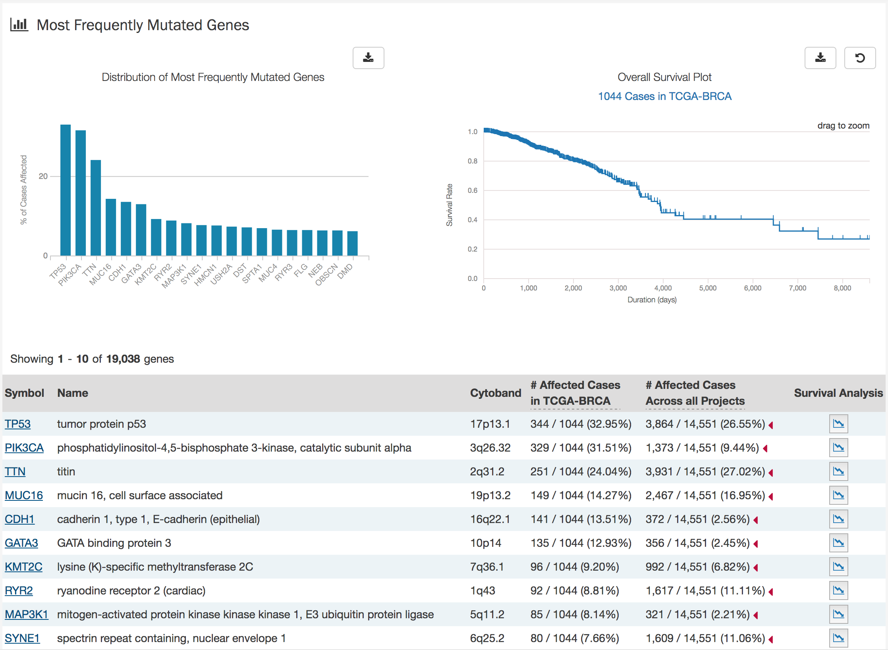

## Project Detail Page

Each project has its own detail page that provides an overview of all cases, files and annotations available for the project. Clicking on summary numbers on the page will display the corresponding data.

Three download buttons in the top right corner of the screen allow the user to download the entire project dataset along with the associated project metadata:

* __Download Manifest__: Download a manifest of all data files available in the project. The manifest can be used with the GDC Data Transfer Tool to download the files.
* __Download Clinical__: Download clinical metadata about all cases in the project.
* __Download Biospecimen__: Download metadata about all biospecimens available in the project.

### Most Frequently Mutated Genes

The project detail page also displays information about the most frequently mutated genes in a graphical and tabular format.

The top of this section contains a plot of the most frequently mutated genes and a survival plot of all the cases within the specified project.  Hovering over each bar in the plot will show information about the number of cases affected.

Below these graphs is a tabular view of the genes affected, which includes the following information:

* __Symbol:__ The gene symbol, when clicked, brings up the [Gene Entity Page](GeneEntity.md) for the gene
* __Name:__ Full name of the gene
* __Cytoband:__ The gene's cytoband notation
* __# Affected Cases in Project:__ The number of cases within the specified project that contain a mutation on this gene
* __# Affected Cases in GDC:__ The number of cases within all the projects in the GDC that contain a mutation on this gene
* __# Mutations:__ The number of SSMs in the gene
* __Survival Analysis:__ An icon that when clicked, will plot the survival rate between the gene's mutated and non-mutated cases

### OncoGrid

The project detail page includes an OncoGrid plot of all the cases for the specific project, for the top 50 mutated genes affected by high impact mutations.  Genes displayed on the left of the grid (Y-axis) correspond to individual patient cases on the bottom of the grid (X-axis).  

The grid is color coded with a legend at the top left, describing what type of mutation is observed on the gene for that case. Located at the bottom of the grid, is clinical information and the available data for each case.

The grid is interactive, meaning genes can be rearranged on the left axis and hovering over parts of the grid will display key information about the case and gene under consideration.

The right side of the grid displays additional information about the genes under consideration:

* __Gene Sets:__ Tells whether a gene is part of the Gene Census.  (The cancer Gene Census is an ongoing effort to catalogue those genes for which mutations have been causally implicated in cancer)
* __GDC:__ Heatmap of all cases in the GDC affected with a mutation in this gene

#### OncoGrid Options

In the top right corner of the OncoGrid, a number of options are available:

* __Download:__ Users can choose to export the contents either to a static image file (PNG or SVG format) or the underlying data in JSON format
* __Refresh:__ Reloads the OncoGrid
* __Cluster Data:__ ????
* __Toggle Heatmap:__ This toggles view of the grid, to show a heatmap of the frequency of mutations
* __Toggle Gridlines:__ Turn the gridlines on and off
* __Toggle Crosshairs:__ Turns crosshairs on, so that users can zoom into specific sections of the OncoGrid
* __Fullscreen:__ Turns fullscren mode on/off

### Most Frequent Mutations

The ten most frequent mutations in the gene are displayed as a bar graph that indicates the number of cases that share each mutation.  

The top of this section contains a plot of the most frequently mutated genes and a survival plot of all the cases within the specified project.  Hovering over each bar in the plot will show information about the number of cases affected.

A table is displayed below that lists information about each mutation including:

* __ID:__ Unique ID Code for the mutation, when clicked will bring a user to the [Mutation Entity Page](MutationEntity.md)
* __DNA Change:__ The chromosome and starting coordinates of the mutation are displayed along with the nucleotide differences between the reference genome and tumor sample.  
* __Type:__ A general classification of the mutation
* __Consequences:__ The amino acid change in the gene is displayed here
* __# Affected Cases in Project:__ The number of affected cases in the particular project
* __# Affected Cases in GDC:__ The number of affected cases, expressed as number across all projects. Choosing the arrow next to the percentage will expand the selection with a breakdown of each affected project.
* __Impact:__ A classification of the biological impact of this mutation
* __Survival Analysis:__ An icon that when clicked, will plot the survival rate between the gene's mutated and non-mutated cases
