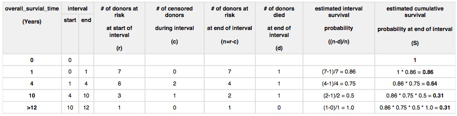
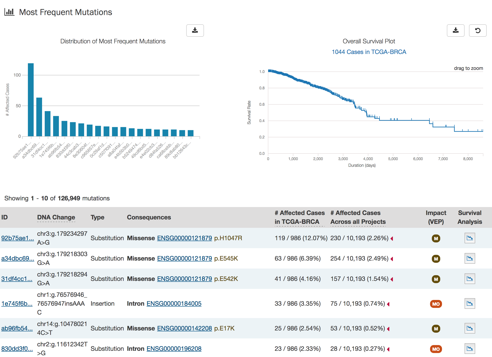
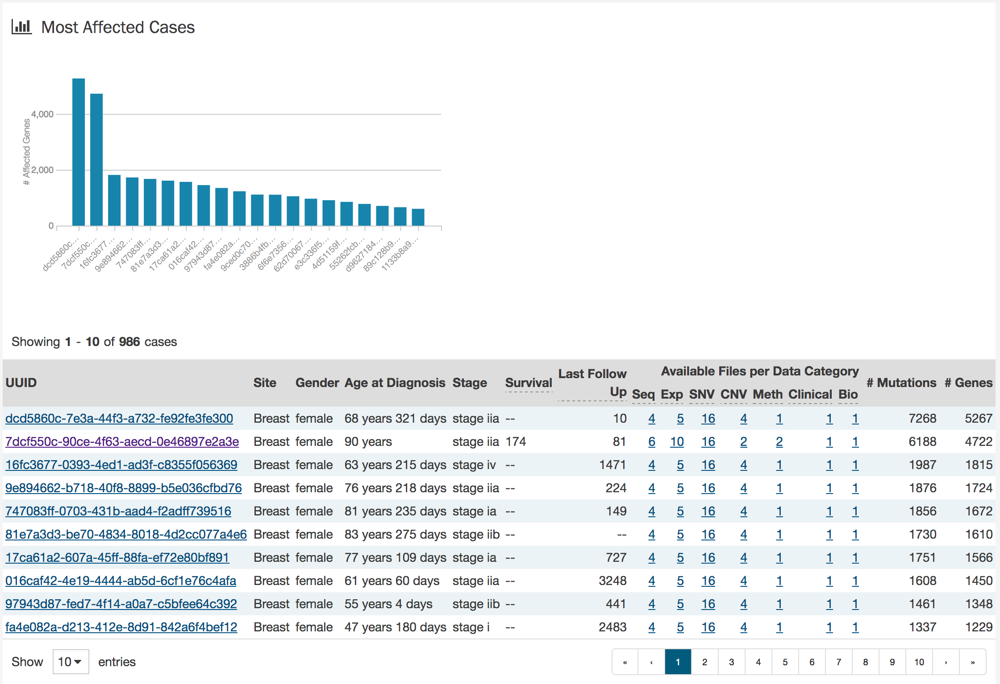

# Project Detail Page

Each project has its own detail page that provides an overview of all cases, files and annotations available for the project. Clicking on the numbers in the summary table will display the corresponding data.

Three download buttons in the top right corner of the screen allow the user to download the entire project dataset, along with the associated project metadata:

* __Download Manifest__: Download a manifest of all data files available in the project. The manifest can be used with the GDC Data Transfer Tool to download the files.
* __Download Clinical__: Download clinical metadata about all cases in the project.
* __Download Biospecimen__: Download metadata about all biospecimen available in the project.

## Most Frequently Mutated Genes

The project detail page also displays the genes in which the most somatic mutations are observed in a graphical and tabular format.

The top of this section contains a plot of the most frequently mutated genes and a survival plot of all the cases within the specified project.  Hovering over each bar in the plot will show information about the number of cases affected. Users may choose to download the underlying data by clicking the `download` icon at the top of each graph.

Below these graphs is a tabular view of the genes affected which includes the following information:

* __Symbol:__ The gene symbol when clicked, brings up the [Gene Entity Page](GeneEntity.md)
* __Name:__ Full name of the gene
* __Cytoband:__ The location of the mutation on the chromosome in terms of Giemsa-stained samples.
* __# Affected Cases in Project:__ The number of cases within the specified project that contain a mutation on this gene
* __# Affected Cases in GDC:__ The number of cases within all the projects in the GDC that contain a mutation on this gene
* __# Mutations:__ The number of SSMs (somatic mutations detected in that gene)
* __Survival Analysis:__ An icon that when clicked, will plot the survival rate between the gene's mutated and non-mutated cases in the survival plot above

### Survival Analysis

Survival analysis is used to analyze the occurrence of event data over time.  In the GDC, survival analysis is done on the mortality of the cases.  Survival analysts requires:
*  Data on the time to a particular event (days from diagnosis to death)
*  Information on whether the event has occurred (alive/deceased)
*  Data split into different categories or groups (i.e. gender)

The survival analysis in the GDC uses a Kaplan-Meier estimator:

Where:
 * S(ti) is the estimated survival probability for any particular one of the t time periods
 * ni is the number of subjects at risk at the beginning of time period ti
 * and di is the number of subjects who die during time period ti

The table below is an example data set to calculate survival for a set of 7 cases:

The calculated cumulated survival probability can be plotted against the interval to obtain a survival plot like the one shown below.

## OncoGrid

The project detail page includes an OncoGrid plot of all the cases for the specific project, for the top 50 mutated genes affected by high impact mutations.  Genes displayed on the left of the grid (Y-axis) correspond to individual patient cases on the bottom of the grid (X-axis).  

The grid is color-coded with a legend at the top left which describes what type of mutation is observed for each gene/case combination. Located at the bottom of the grid is clinical information and the available data for each case.

The grid is interactive, meaning genes can be rearranged on the left axis and hovering over parts of the grid will display key information about the case and gene under consideration.

The right side of the grid displays additional information about the genes under consideration:

* __Gene Sets:__ Describes whether a gene is part of the Gene Census.  (The cancer Gene Census is an ongoing effort to catalogue those genes for which mutations have been causally implicated in cancer)
* __GDC:__ Heat-map of all cases in the GDC affected with a mutation in this gene

### OncoGrid Options

To facilitate readability and comparisons, drag-and-drop can be used to reorder the gene rows.  Double clicking a row in the "# Cases Affected" bar at the right side of the graphic will bring the user to the respective [Gene Entity](GeneEntity.md) page. Hovering over a cell will display information about the mutation such as its ID and biological consequence. Clicking on the cell will bring the user to the respective [Mutation Entity](MutationEntity.md) page.  

A tool bar at the top right of the graphic allows the user to export the data as a JSON object, PNG image, or SVG image.  Seven buttons are available in this toolbar:

* __Download:__ Users can choose to export the contents either to a static image file (PNG or SVG format) or the underlying data in JSON format
* __Refresh:__ Sets all OncoGrid rows, columns, and zoom levels back to their initial positions
* __Cluster Data:__ Clusters the rows and columns to place mutated genes with the same cases and cases with the same mutated genes together
* __Toggle Heatmap:__ The view can be toggled between cells representing mutation consequences or number of mutations in each gene
* __Toggle Gridlines:__ Turn the gridlines on and off
* __Toggle Crosshairs:__ Turns crosshairs on, so that users can zoom into specific sections of the OncoGrid
* __Fullscreen:__ Turns Fullscreen mode on/off

## Most Frequent Mutations
The project detail page also displays the ten most frequent mutations as a bar graph that indicates the number of cases that share each mutation.  

The top of this section contains a plot of the most frequently mutated genes and a survival plot of all the cases within the specified project.  Hovering over each bar in the plot will show information about the number of cases affected.

A table is displayed below that lists information about each mutation including:

* __ID:__ A UUID Code for the mutation assigned by the GDC, when clicked will bring a user to the [Mutation Entity Page](MutationEntity.md)
* __DNA Change:__ The chromosome and starting coordinates of the mutation are displayed along with the nucleotide differences between the reference genome and tumor sample.  
* __Type:__ A general classification of the mutation
* __Consequences:__ The effects the mutation has on the gene coding for a protein (i.e. synonymous, missense, non-coding transcript).  A link to the [Gene Entity Page](GeneEntity.md) for the gene affected by the mutation is included
* __# Affected Cases in Project:__ The number of affected cases in the particular project
* __# Affected Cases in GDC:__ The number of affected cases, expressed as number across all projects. Choosing the arrow next to the percentage will expand the selection with a breakdown of each affected project.
* __Impact:__ A subjective classification of the severity of the variant consequence. The categories are:
  * __HIGH__: The variant is assumed to have high (disruptive) impact in the protein, probably causing protein truncation, loss of function or triggering nonsense mediated decay.
  * __MODERATE__: A non-disruptive variant that might change protein effectiveness.
  * __LOW__: Assumed to be mostly harmless or unlikely to change protein behavior.
* __Survival Analysis:__ An icon that when clicked, will plot the survival rate between the gene's mutated and non-mutated cases

## Most Affected Cases

The final section of the project entity page is a display of the top 20 cases in a specified project, with the most affected genes.

Below the bar graph, a table contains information about these cases:

* __UUID:__ The UUID of the case, which directs the user to the [Case Entity  Page](docs/Data_Portal/Users_Guide/Cases_and_Files.md#case-detail-page)
* __Site:__  The anatomical location of the site affected
* __Gender:__ Text designations that identify gender. Gender is described as the assemblage of properties that distinguish people on the basis of their societal roles
* __Age at Diagnosis:__ Age at the time of diagnosis expressed in number of days since birth
* __Stage:__ The extent of a cancer in the body. Staging is usually based on the size of the tumor, whether lymph nodes contain cancer, and whether the cancer has spread from the original site to other parts of the body. The accepted values for tumor_stage depend on the tumor site, type, and accepted staging system
* __Survival:__ The survival state of the person
* __Last Follow Up:__ Time interval from the date of last follow up to the date of initial pathologic diagnosis, represented as a calculated number of days
* __Available Files per Data Category:__ Five columns displaying the number of files available in each of the five data categories.  These link to the files for the specific case.
* __Mutations:__ The number of mutations for the case
* __Genes:__ The number of genes affected by mutations for the case
