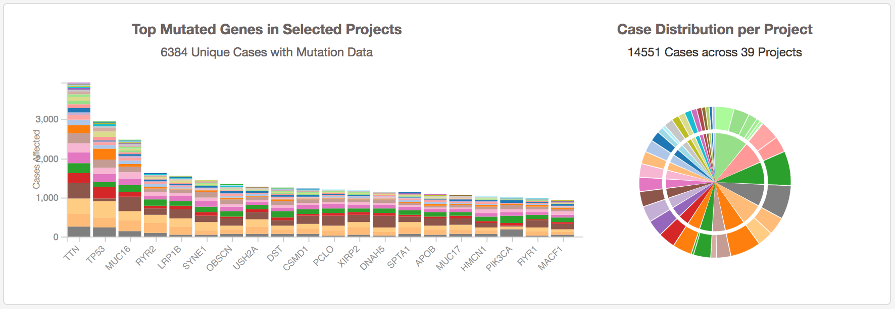
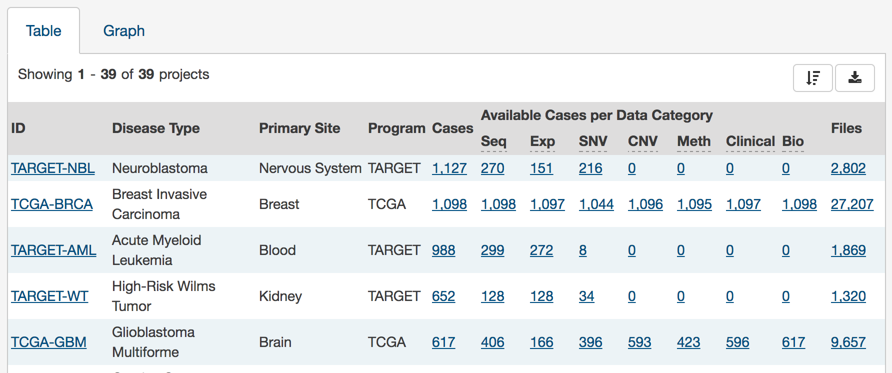

# Project List Page

The project list page displays statistics about the projects that are available at the GDC.  

## Top Mutated Genes in Selected Projects

This dynamically generated bar graph shows the ten genes with the most mutations. The bars represent the frequency of each mutation and is broken down into different colored segments by project and disease type. The graphic is updated as filters are applied for projects, programs, disease types, and data categories available to the project.

Hovering the cursor over each bar will display information about the number of cases affected by the disease type and clicking on each bar will bring the user to the [Gene Summary Page](GeneEntity.md) page for the gene associated with the mutation.

## Case Distribution per Project

A pie graph displays the relative number of cases for each primary site (inner circle), which is further divided by project (outer circle). Hovering the cursor over each portion of the graph will display the primary site or project with the number of associated cases. Filtering projects at the left panel will update the pie chart.

## Project Table

General information about each of the projects is displayed below the graphs. The numbers of available cases per data category for each project are displayed as links. Clicking on a specific project will bring a user to that project's [Project Detail Page](ProjectDetailPage.md), which provides an overview of all cases, files and annotations available for the project.
