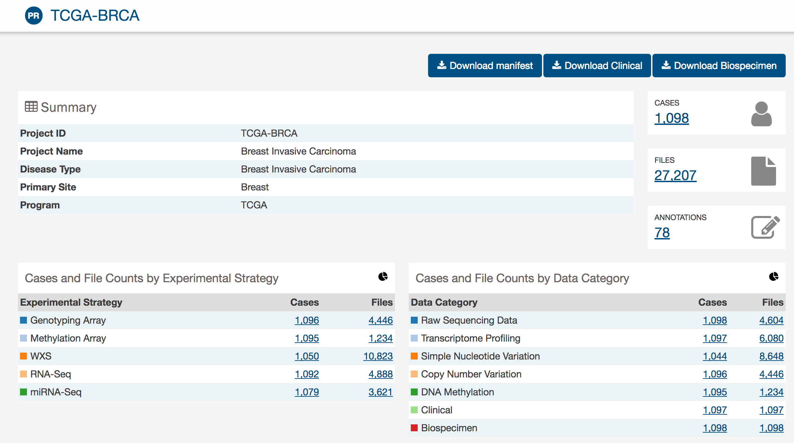
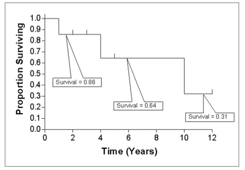
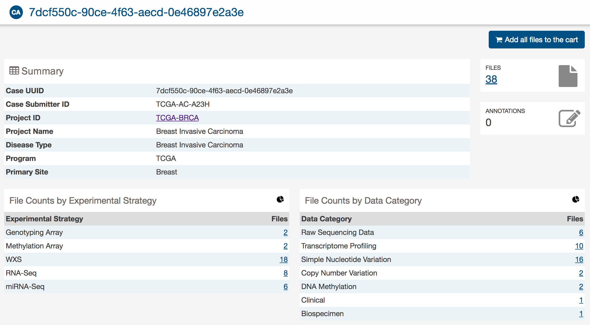
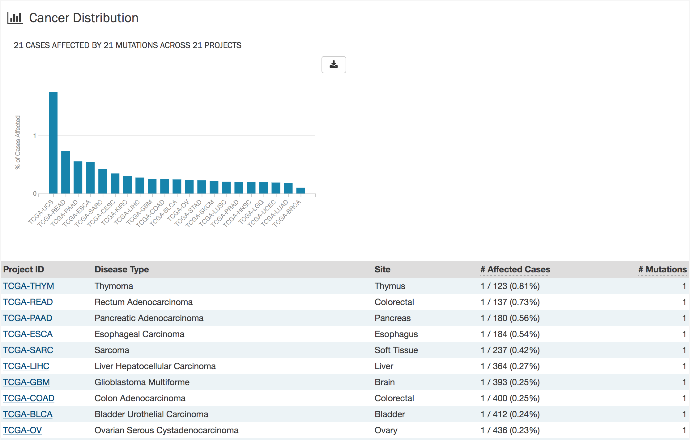
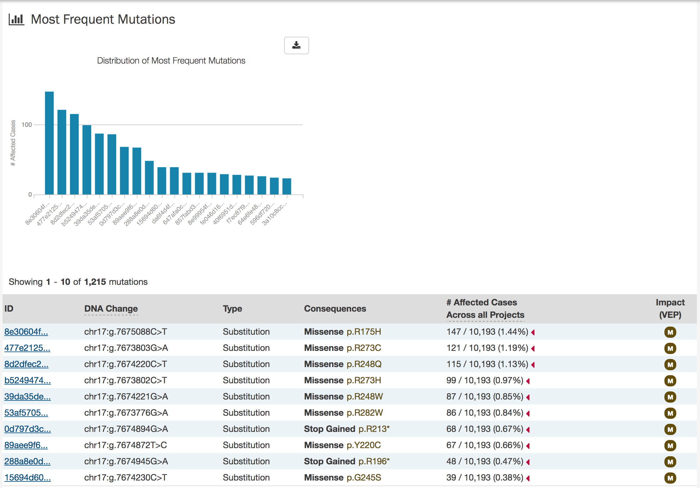

# GDC Visualization Suite

This guide describes the new data visualization features that can be accessed at the GDC Data Portal. Visualization features include detailed descriptions of mutations, genes, and their frequency; graphical representation of mutation positions, and dynamic survival analysis plots. Additionally, new API endpoints are available for users to programmatically retrieve the data used to generate the visualization features.  

The mutation-based visualization features are derived from open-access MAF files that were produced by GDC variant-calling pipelines. The format of these MAF files was developed by and for the GDC and is outlined in the MAF Format documentation.

## GDC Portal Home Page

The [GDC Portal](https://gdc-portal-staging.datacommons.io) home page is the entry way to accessing data in the Genomic Data Commons.  

[](images/GDC-Home-Page.png "Click to see the full image.")

The Genomic Data Commons is organized by project based on a primary site (i.e Brain). Data can be narrowed down in a few ways listed below.

* __Projects__: The projects link directs users to the Project List Page, listing project-level information.

* __Repository__: The repository link allows users to see all data contained in the GDC and apply file/case filters to narrow down their search.

* __Human Outline__: The home page displays a human anatomical outline that a user may use to refine their search. Clicking on an associated organ will direct to a user to a listing of all projects associated with that primary site. For example, clicking on the human brain will show only cases and projects associated with brain cancer.  This visualization also displays statistics on the number of cases associated with each primary site.
# Project List Page

The Project List page displays statistics about the projects that are available at the GDC.  

[](images/GDC-PL-Graphs.png "Click to see the full image.")

## Top Mutated Genes in Selected Projects

This dynamically generated bar graph shows the ten genes with the most mutations. The bars represent the frequency of each mutation and is broken down into different colored segments by project and disease type. The graphic is updated as filters are applied for projects, programs, disease types, and data categories available to the project.

Hovering the cursor over each bar will display information about the number of cases affected by the disease type and clicking on each bar will bring the user to the Gene Summary Page page for the gene associated with the mutation.

## Cases Distribution per Project

A pie graph displays the relative number of cases for each primary site (inner circle), which is further divided by project (outer circle). Hovering the cursor over each portion of the graph will display the primary site or project with the number of associated cases. Filtering projects at the left panel will update the pie chart.

## Project Table

[](images/GDC-PL-Table.png "Click to see the full image.")

General information about each of the projects is displayed below the graphs. The numbers of available cases per data category for each project are displayed as links. Clicking on a specific project will bring a user to that project's Project Detail Page, which provides an overview of all cases, files and annotations available for the project.
# Project Detail Page

Each project has a detail page that provides an overview of all cases, files, and annotations available for the project. Clicking on the numbers in the summary table will display the corresponding data.

[](images/gdc-project-entity-page.png "Click to see the full image.")

Three download buttons in the top right corner of the screen allow the user to download the entire project dataset, along with the associated project metadata:

* __Download Manifest__: Download a manifest for all data files available in the project. The manifest can be used with the GDC Data Transfer Tool to download the files.
* __Download Clinical__: Download clinical metadata about all cases in the project.
* __Download Biospecimen__: Download all biospecimen metadata associated with all cases in the project.

## Most Frequently Mutated Genes

The project detail page also reports the genes that have somatic mutations in the greatest numbers of cases in a graphical and tabular format.

[](images/gdc-frequently-mutated-genes.png "Click to see the full image.")

The top of this section also contains a survival plot of all the cases within the specified project. Hovering over each bar in the plot will display information about the number of cases affected. Users may choose to download the underlying data in JSON or TSV format or an image of the graph in SVG or PNG format by clicking the `download` icon at the top of each graph.

Below these graphs is a tabular view of the genes affected which includes the following information:

* __Symbol:__ The gene symbol. When clicked, it links the Gene Summary Page
* __Name:__ Full name of the gene
* __Cytoband:__ The location of the mutation on the chromosome in terms of Giemsa-stained samples.
* __# Affected Cases in Project:__ The number of cases within the project that contain a mutation on this gene
* __# Affected Cases Across all Projects:__ The number of cases within all the projects in the GDC that contain a mutation on this gene.  Clicking the red arrow will display the cases broken down by project.
* __# Mutations:__ The number of SSMs (simple somatic mutations) detected in that gene
* __Survival Analysis:__ An icon that, when clicked, will plot the survival rate between cases in the project with mutated and non-mutated forms of the gene.

### Survival Analysis

Survival analysis is used to analyze the occurrence of event data over time.  In the GDC, survival analysis is performed on the mortality of the cases.  Survival analysis requires:

*  Data on the time to a particular event (days to death or last follow up)
    * Fields:  __diagnoses.days_to_death__ and __diagnoses.days_to_last_follow_up__
*  Information on whether the event has occurred (alive/deceased)
    * Fields:  __diagnoses.vital_status__
*  Data split into different categories or groups (i.e. gender, etc.)
    * Fields:  __demographic.gender__

The survival analysis in the GDC uses a Kaplan-Meier estimator:

[](images/gdc-kaplan-meier-estimator "Click to see the full image.")

Where:

 * S(t<sub>i</sub>) is the estimated survival probability for any particular one of the t time periods
 * n<sub>i</sub> is the number of subjects at risk at the beginning of time period t<sub>i</sub>
 * and d<sub>i</sub> is the number of subjects who die during time period t<sub>i</sub>

The table below is an example data set to calculate survival for a set of seven cases:

[](images/gdc-sample-survival-table.png "Click to see the full image.")

The calculated cumulated survival probability can be plotted against the interval to obtain a survival plot like the one shown below.

[](images/gdc-survival-plot.png "Click to see the full image.")


## OncoGrid

The project detail page includes an OncoGrid plot of the cases with the most mutations, for the top 50 mutated genes affected by high impact mutations. Genes displayed on the left of the grid (Y-axis) correspond to individual patient cases on the bottom of the grid (X-axis).  

[](images/gdc-oncogrid.png "Click to see the full image.")

The grid is color-coded with a legend at the top left which describes what type of mutation consequence is observed for each gene/case combination. Clinical information and the available data for each case are available at the bottom of the grid.

The right side of the grid displays additional information about the genes:

* __Gene Sets:__ Describes whether a gene is part of the [Gene Census](http://cancer.sanger.ac.uk/census/).  (The cancer Gene Census is an ongoing effort to catalogue those genes for which mutations have been causally implicated in cancer)
* __GDC:__ Heat-map of all cases in the GDC affected with a mutation in this gene

### OncoGrid Options

To facilitate readability and comparisons, drag-and-drop can be used to reorder the gene rows.  Double clicking a row in the "# Cases Affected" bar at the right side of the graphic will bring the user to the respective Gene Summary Page page. Hovering over a cell will display information about the mutation such as its ID, affected case, and biological consequence. Clicking on the cell will bring the user to the respective Mutation Summary page.  

A tool bar at the top right of the graphic allows the user to export the data as a JSON object, PNG image, or SVG image.  Seven buttons are available in this toolbar:

* __Download:__ Users can choose to export the contents either to a static image file (PNG or SVG format) or the underlying data in JSON format
* __Refresh:__ Sets all OncoGrid rows, columns, and zoom levels back to their initial positions
* __Cluster Data:__ Clusters the rows and columns to place mutated genes with the same cases and cases with the same mutated genes together
* __Toggle Heatmap:__ The view can be toggled between cells representing mutation consequences or number of mutations in each gene
* __Toggle Gridlines:__ Turn the gridlines on and off
* __Toggle Crosshairs:__ Turns crosshairs on, so that users can zoom into specific sections of the OncoGrid
* __Fullscreen:__ Turns Fullscreen mode on/off

## Most Frequent Mutations
The project detail page also displays the 20 most frequent mutations as a bar graph that indicates the number of cases that are affected by each mutation.  

[](images/gdc-frequent-mutations.png "Click to see the full image.")

The top of this section also a survival plot of all the cases within the specified project.  Hovering over each bar in the plot will show information about the number of cases affected.

A table is displayed below that lists information about each mutation including:

* __ID:__ A UUID Code for the mutation assigned by the GDC, when clicked will bring a user to the Mutation Summary Page
* __DNA Change:__ The chromosome and starting coordinates of the mutation are displayed along with the nucleotide differences between the reference genome and tumor sample.  
* __Type:__ A general classification of the mutation
* __Consequences:__ The effects the mutation has on the gene coding for a protein (i.e. synonymous, missense, non-coding transcript).  A link to the Gene Summary Page for the gene affected by the mutation is included
* __# Affected Cases in Project:__ The number of affected cases in the particular project
* __# Affected Cases in Across all Projects:__ The number of affected cases, expressed as number across all projects. Choosing the arrow next to the percentage will expand the selection with a breakdown of each affected project.
* __Impact:__ A subjective classification of the severity of the variant consequence. The categories are:
    * __HIGH__: The variant is assumed to have high (disruptive) impact in the protein, probably causing protein truncation, loss of function or triggering nonsense mediated decay.
    * __MODERATE__: A non-disruptive variant that might change protein effectiveness.
    * __LOW__: Assumed to be mostly harmless or unlikely to change protein behavior.
* __Survival Analysis:__ An icon that when clicked, will plot the survival rate between the gene's mutated and non-mutated cases

## Most Affected Cases

The final section of the project detail page is a display of the top 20 cases in a specified project, with the greatest number of affected genes.

[](images/gdc-most-affected-cases.png "Click to see the full image.")

Below the bar graph, a table contains information about these cases:

* __UUID:__ The UUID of the case, which directs the user to the Case Summary Page
* __Site:__  The anatomical location of the site affected
* __Gender:__ Text designations that identify gender. Gender is described as the assemblage of properties that distinguish people on the basis of their societal roles
* __Age at Diagnosis:__ Age at the time of diagnosis expressed in number of days since birth
* __Stage:__ The extent of a cancer in the body. Staging is usually based on the size of the tumor, whether lymph nodes contain cancer, and whether the cancer has spread from the original site to other parts of the body. The accepted values for tumor_stage depend on the tumor site, type, and accepted staging system
* __Survival:__ The number of days until death
* __Last Follow Up:__ Time interval from the date of last follow up to the date of initial pathologic diagnosis, represented as a calculated number of days
* __Available Files per Data Category:__ Five columns displaying the number of files available in each of the five data categories.  These link to the files for the specific case.
* __Genes:__ The number of genes affected by mutations for the case

# Case Summary Page

The Case Summary Page displays case details including the project and disease information, data files that are available for that case, and the experimental strategies employed. A button in the top-right corner of the page allows the user to add all files associated with the case to the file cart.

[](images/gdc-case-entity-page.png "Click to see the full image.")

## Clinical and Biospecimen Information

The page also provides clinical and biospecimen information about that case. Links to export clinical and biospecimen information in JSON format are provided.

[](images/gdc-case-clinical-biospecimen.png "Click to see the full image.")

For clinical records that support multiple records of the same type (Diagnoses, Family Histories, or Exposures), a UUID of the record is provided on the left hand side of the corresponding tab, allowing the user to select the entry of interest:

### Biospecimen Search

A search filter just below the biospecimen section can be used to find and filter biospecimen data. The wildcard search will highlight entities in the tree that match the characters typed. This will search both the case submitter ID, as well as the additional metadata for each entity. For example, searching 'Primary Tumor' will highlight samples that match that type.

[](images/gdc-case-biospecimen-search.png "Click to see the full image.")

## Most Frequent Mutations

The case page will also display the most frequent mutations in the case.  It is displayed as a bar graph that shows the most frequent mutations across GDC that are carried by this case.

[](images/gdc-case-most-frequent-mutations.png "Click to see the full image.")

A table is displayed below that lists information about each mutation including:

* __ID:__ A UUID Code for the mutation assigned by the GDC, when clicked will bring a user to the Mutation Summary Page
* __DNA Change:__ The chromosome and starting coordinates of the mutation are displayed along with the nucleotide differences between the reference genome and tumor sample.  
* __Type:__ A general classification of the mutation
* __Consequences:__ The effects the mutation has on the gene coding for a protein (i.e. synonymous, missense, non-coding transcript).  A link to the Gene Summary Page for the gene affected by the mutation is included
* __# Affected Cases in Project:__ The number of affected cases in the particular project
* __# Affected Cases in GDC:__ The number of affected cases, expressed as number across all projects. Choosing the arrow next to the percentage will expand the selection with a breakdown of each affected project.
* __Impact:__ A subjective classification of the severity of the variant consequence. The categories are:
  - __HIGH__: The variant is assumed to have high (disruptive) impact in the protein, probably causing protein truncation, loss of function or triggering nonsense mediated decay.
  - __MODERATE__: A non-disruptive variant that might change protein effectiveness.
  - __LOW__: Assumed to be mostly harmless or unlikely to change protein behavior.

# Gene Summary Page

The Gene Summary Page describes each gene with mutation data featured at the GDC and provides results related to the analyses that are performed on these genes.  

## Summary

The summary section of the gene page contains the following information:

[](images/GDC-Gene-Summary.png "Click to see the full image.")

* __Symbol:__ The gene symbol
* __Name:__ Full name of the gene
* __Synonyms:__ Synonyms of the gene name or symbol, if available
* __Type:__ A broad classification of the gene
* __Location:__ The chromosome on which the gene is located and its coordinates
* __Strand:__ If the gene is located on the forward (+) or reverse (-) strand
* __Description:__ A description of gene function and downstream consequences of gene alteration.

## External References

A list with links that lead to external databases with additional information about each gene is displayed here. These external databases include: [Entrez](https://www.ncbi.nlm.nih.gov/gquery/), [Hugo Gene Nomenclature Committee](http://www.genenames.org/), [Online Mendelian Inheritance in Man](https://www.omim.org/), and [Uniprotkb SwissProt](http://www.uniprot.org/).

## Cancer Distribution

[](images/GDC-Gene-CancerDist.png "Click to see the full image.")

A table and bar graph displayed that shows how many cases are affected by mutations within the gene as a ratio and percentage. Each row/bar represents the number of cases for each project.

## Protein Viewer

[](images/GDC-Gene-ProteinGraph.png "Click to see the full image.")

Mutations and their frequency across cases are mapped to a graphical visualization of protein-coding regions with a lollipop plot. Pfam domains are highlighted along the x-axis to assign functionality to specific protein-coding regions. The bottom track represents a view of the full gene length. Different transcripts can be selected by using the drop-down menu above the plot.  

The panel to the right of the plot allows the plot to be filtered by mutation consequence or impact.  The plot will dynamically change as filters are applied.  Mutation consequence and impact is denoted in the plot by color.

The plot can be viewed at different zoom levels by clicking and dragging across the x-axis, clicking and dragging across the bottom track, or double clicking the pfam domain IDs. The `Reset` button can be used to bring the zoom level back to its original position. The plot can also be exported as a PNG image, SVG image or as JSON formatted text by choosing the `Download` button above the plot.

## Most Frequent Mutations

The 20 most frequent mutations in the gene are displayed as a bar graph that indicates the number of cases that share each mutation.  

[](images/GDC-Gene-MFM.png "Click to see the full image.")

A table is displayed below that lists information about each mutation including:

* __ID:__ A UUID Code for the mutation assigned by the GDC, when clicked will bring a user to the Mutation Summary Page
* __DNA Change:__ The chromosome and starting coordinates of the mutation are displayed along with the nucleotide differences between the reference genome and tumor sample.  
* __Type:__ A general classification of the mutation
* __Consequences:__ The effects the mutation has on the gene coding for a protein (i.e. synonymous, missense, non-coding transcript).
* __# Affected Cases:__ The number of affected cases, expressed as number across all projects. Choosing the arrow next to the percentage will expand the selection with a breakdown of each affected project.
* __Impact:__ A subjective classification of the severity of the variant consequence. The categories are:
  - __HIGH__: The variant is assumed to have high (disruptive) impact in the protein, probably causing protein truncation, loss of function or triggering nonsense mediated decay.
  - __MODERATE__: A non-disruptive variant that might change protein effectiveness.
  - __LOW__: Assumed to be mostly harmless or unlikely to change protein behavior.

# Mutation Summary Page

The Mutation Summary Page contains information about a particular mutation and how it affects the associated gene. Each mutation is identified by its chromosomal position and nucleotide-level change.

## Summary

[](images/GDC-Mutation-Summary.png "Click to see the full image.")

- __ID:__ A unique identifier (UUID) for this mutation
- __DNA Change:__ Denotes the chromosome number, position, and nucleotide change of the mutation
- __Type:__ A broad categorization of the mutation
- __Reference Genome Assembly:__ The reference genome in which the chromosomal position refers to
- __Allele in the Reference Assembly:__ The nucleotide(s) that compose the site in the reference assembly
- __Functional Impact:__ A subjective classification of the severity of the variant consequence. The categories are:
  - __HIGH__: The variant is assumed to have high (disruptive) impact in the protein, probably causing protein truncation, loss of function or triggering nonsense mediated decay.
  - __MODERATE__: A non-disruptive variant that might change protein effectiveness.
  - __LOW__: Assumed to be mostly harmless or unlikely to change protein behavior.

### External References

A separate panel contains links to information about the gene that the mutation effects in external databases. These databases include: [Entrez](https://www.ncbi.nlm.nih.gov/gquery/), [Hugo Gene Nomenclature Committee](http://www.genenames.org/), [Online Mendelian Inheritance in Man](https://www.omim.org/), and [Uniprotkb SwissProt](http://www.uniprot.org/).

## Consequences

[](images/GDC-Mutation-Consequences.png "Click to see the full image.")

The consequences of the mutation are displayed in a table. The fields that detail each mutation are listed below:

* __Gene:__ The symbol for the affected gene
* __AA Change:__ Details on the amino acid change, including compounds and position, if applicable
* __Consequence:__ The biological consequence of each mutation
* __Coding DNA Change:__ The specific nucleotide change and position of the mutation within the gene
* __Strand:__ If the gene is located on the forward (+) or reverse (-) strand
* __Transcript(s):__ The transcript(s) affected by the mutation. Each contains a link to the [Ensembl](https://www.ensembl.org) entry for the transcript.     

## Cancer Distribution

[](images/GDC-Mutation-CancerDist.png "Click to see the full image.")

A bar graph detailing the number of cases affected by the mutation across all projects is generated dynamically.  Below the graph is a table with information about how the mutation affects each project, which can be exported as a JSON object. The table contains the following fields:

* __Project ID__: The ID for a specific project
* __Disease Type__: The disease associated with the project
* __Site__: The anatomical site affected by the disease
* __# Affected Cases__: The number of affected cases and total number of cases displayed as a fraction and percentage

## Protein Viewer

[](images/GDC-Mutation-ProteinGraph.png "Click to see the full image.")

The protein viewer displays a plot representing the position of mutations along the polypeptide chain associated with the mutation. The y-axis represents the number of cases that exhibit each mutation, whereas the x-axis represents the polypeptide chain. [Pfam domains](http://pfam.xfam.org/) that were identified along the polypeptide chain are identified with colored rectangles labeled with pfam IDs. See the Gene Summary Page for additional details about the protein viewer.

# Visualization API Endpoint Additions

The GDC Visualization Suite uses the same API as the rest of the Data Portal and takes advantage of several new endpoints:

* __ssms:__ The simple somatic mutation (`ssms`) endpoint allows users to access information about each somatic point mutation. For example, a `ssm` would represent the transition of C to T at position 52000 of chromosome 1.  
* __ssm_occurrences:__ A SSM entity as applied to a single instance (case). An example of a `ssm occurrence` would be that the transition of C to T at position 52000 of chromosome 1 occurred in patient TCGA-XX-XXXX.  
* __genes:__ The `genes` endpoint allows users to access in-depth information about each gene.  

The methods for retrieving information from these endpoint are very similar to those used for the `cases` and `files` endpoints. These methods are explored in depth in the [API Search and Retrieval](https://docs.gdc.cancer.gov/API/Users_Guide/Search_and_Retrieval/) documentation. The `_mapping` parameter can also be used with each of these endpoints to generate a list of potential fields.  For example:

`https://gdc-api-staging.datacommons.io/ssms/_mapping`

While it is not an endpoint, the `observation` entity is featured in the visualization section of the API. The `observation` entity provides information from the MAF file, such as read depth and normal genotype, that supports the validity of the associated `ssm`.  

[](images/Viz_Model.png "Click to see the full image.")

## Endpoint Examples

__Example 1:__ A user would like to access information about the gene `ZMPSTE24`, which has an Ensembl gene ID of `ENSG00000084073`.  This would be accomplished by appending `ENSG00000084073` (`gene_id`) to the `genes` endpoint.

```Shell
curl "https://gdc-api-staging.datacommons.io/genes/ENSG00000084073?pretty=true"
```
```Response
{
  "data": {
    "description": "This gene encodes a member of the peptidase M48A family. The encoded protein is a zinc metalloproteinase involved in the two step post-translational proteolytic cleavage of carboxy terminal residues of farnesylated prelamin A to form mature lamin A. Mutations in this gene have been associated with mandibuloacral dysplasia and restrictive dermopathy. [provided by RefSeq, Jul 2008]",
    "cytoband": [
      "1p34.2"
    ],
    "gene_start": 40258107,
    "symbol": "ZMPSTE24",
    "gene_id": "ENSG00000084073",
    "gene_chromosome": "1",
    "synonyms": [
      "FACE-1",
      "HGPS",
      "PRO1",
      "STE24",
      "Ste24p"
    ],
    "is_cancer_gene_census": null,
    "biotype": "protein_coding",
    "gene_end": 40294184,
    "canonical_transcript_id": "ENST00000372759",
    "gene_strand": 1,
    "name": "zinc metallopeptidase STE24"
  },
  "warnings": {}
}
```

__Example 2:__ A user wants a list of coordinates for all genes on chromosome 7. The query can be filtered for only results from chromosome 7 using a JSON-formatted query that is URL-encoded.

```Shell
curl "https://gdc-api-staging.datacommons.io/genes?pretty=true&fields=gene_id,symbol,gene_start,gene_end&format=tsv&size=2000&filters=%7B%0D%0A%22op%22%3A%22in%22%2C%0D%0A%22content%22%3A%7B%0D%0A%22field%22%3A%22gene_chromosome%22%2C%0D%0A%22value%22%3A%5B%0D%0A%227%22%0D%0A%5D%0D%0A%7D%0D%0A%7D"
```
```Response
gene_start      gene_end        symbol  id
28995231        29195451        CPVL    ENSG00000106066
33014114        33062797        NT5C3A  ENSG00000122643
143052320       143053347       OR6V1   ENSG00000225781
100400826       100428992       ZCWPW1  ENSG00000078487
73861159        73865893        WBSCR28 ENSG00000175877
64862999        64864370        EEF1DP4 ENSG00000213640
159231435       159233377       PIP5K1P2        ENSG00000229435
141972631       141973773       TAS2R38 ENSG00000257138
16646131        16706523        BZW2    ENSG00000136261
149239651       149255609       ZNF212  ENSG00000170260
57405025        57405090        MIR3147 ENSG00000266168
130393771       130442433       CEP41   ENSG00000106477
150800403       150805120       TMEM176A        ENSG00000002933
93591573        93911265        GNGT1   ENSG00000127928
117465784       117715971       CFTR    ENSG00000001626
5879827 5886362 OCM     ENSG00000122543
144118461       144119360       OR2A15P ENSG00000239981
30424527        30478784        NOD1    ENSG00000106100
137227341       137343865       PTN     ENSG00000105894
84876554        84876956        HMGN2P11        ENSG00000232605
107470018       107475659       GPR22   ENSG00000172209
31330711        31330896        RP11-463M14.1   ENSG00000271027
78017057        79453574        MAGI2   ENSG00000187391
55736779        55739605        CICP11  ENSG00000237799
142111749       142222324       RP11-1220K2.2   ENSG00000257743
(truncated)
```

__Example 3:__ A user wants to determine which chromosome in case `TCGA-DU-6407` contains the greatest number of ssms. Because this relates to mutations that are observed in a case, the `ssm_occurrences` endpoint is used.

```json
{  
   "op":"in",
   "content":{  
      "field":"case.submitter_id",
      "value":["TCGA-DU-6407"]
   }
}
```
```Shell
curl "https://gdc-api-staging.datacommons.io/ssm_occurrences?format=tsv&fields=ssm.chromosome&size=5000&filters=%7B%0D%0A%22op%22%3A%22in%22%2C%0D%0A%22content%22%3A%7B%0D%0A%22field%22%3A%22case.submitter_id%22%2C%0D%0A%22value%22%3A%5B%0D%0A%22TCGA-DU-6407%22%0D%0A%5D%0D%0A%7D%0D%0A%7D"
```
```Response
chr2    452d43e1-7b07-54f4-89e2-830ee2200d71
chr7    4760a779-60aa-5659-959b-d9d8a4dcd3a0
chr12   45b8955b-dd26-5de9-8e52-44b16618a544
chr6    bc5176cd-3112-52f7-9a98-38f85dd4e020
chr15   0a38de0d-4576-5eb8-917f-e926861a5a13
chr8    d580b1ed-efef-5d00-85bb-68341e82bbf6
chr14   fddd03e2-3486-52cf-9366-5f322996e468
chr12   ae706566-468b-522c-a3ad-6e325bdcc0fc
chr5    ef067db6-2e1a-5ee3-a3cd-2a1283d948a5
chr8    fa88e686-e96a-569a-92b2-576f897a177c
chr6    532825d7-9604-50fc-b661-1355fc1a89b2
chr15   fc52b56d-1a49-58c0-83a0-25a7a259c9cf
chr7    6d287d4c-c8b3-5cf7-9051-94625431e1e5
chr11   87717814-c7d9-5adf-a704-19b7c7b0a5a5
chr2    b1a57129-5a52-5fd9-a6c1-335be26f3b57
chr6    be64ef89-bec0-5472-97e5-e545f2144f22
(truncated)
```

The number of ssms in each chromosome could then be determined by calculating the count of each value in the first column.

## Analysis Endpoints

In addition the `ssms`, `ssm_occurrences`, and `genes` endpoints mentioned previously, several `analysis` endpoints were designed to quickly retrieve specific datasets used for visualization display.  

* __analysis/survival__
* __analysis/top_cases_counts_by_genes__
* __analysis/top_mutated_genes_by_project__
* __analysis/top_mutated_cases_by_gene__
* __analysis/top_mutated_cases_by_ssm__
* __analysis/mutated_cases_count_by_project__

__Example 1:__ The `analysis/top_cases_counts_by_genes` endpoint gives the number of cases with a mutation in each gene listed in the `gene_ids` parameter for each project. Note that this endpoint cannot be used with the `format` or `fields` parameters. In this case, the query will produce the number of cases in each projects with mutations in the gene `ENSG00000155657`.

```Shell
curl "https://gdc-api-staging.datacommons.io/analysis/top_cases_counts_by_genes?gene_ids=ENSG00000155657&pretty=true"
```
```Response
{
  "hits": {
    "hits": [
      {
        "_score": 1.0,
        "_type": "case_centric",
        "_id": "33c09cd7-2ccc-4a69-b738-79dfd9aa149d",
        "_source": {},
        "_index": "gdc_r113_case_centric"
      },
      {
        "_score": 1.0,
        "_type": "case_centric",
        "_id": "73c712fe-54d6-4743-90bb-03313eb9fa77",
        "_source": {},
        "_index": "gdc_r113_case_centric"
      },
      {
        "_score": 1.0,
        "_type": "case_centric",
        "_id": "d26f3a6b-72f4-4e48-815e-57b8b211112d",
        "_source": {},
        "_index": "gdc_r113_case_centric"
      },
      {
        "_score": 1.0,
        "_type": "case_centric",
        "_id": "da5f6940-e8ee-4fd1-a8da-4cd68e02e59c",
        "_source": {},
        "_index": "gdc_r113_case_centric"
      },
      {
        "_score": 1.0,
        "_type": "case_centric",
        "_id": "66e2fda4-23de-49c6-bb89-82e9edc56e4b",
        "_source": {},
        "_index": "gdc_r113_case_centric"
      },
      {
        "_score": 1.0,
        "_type": "case_centric",
        "_id": "5613f5f6-086d-470b-8f77-6dcb7f8625b7",
        "_source": {},
        "_index": "gdc_r113_case_centric"
      },
      {
        "_score": 1.0,
        "_type": "case_centric",
        "_id": "df1e2e79-0126-4f3a-85e3-36f59be04622",
        "_source": {},
        "_index": "gdc_r113_case_centric"
      },
      {
        "_score": 1.0,
        "_type": "case_centric",
        "_id": "f9ce2045-2821-4843-b5e9-cf7cc7e783d4",
        "_source": {},
        "_index": "gdc_r113_case_centric"
      },
      {
        "_score": 1.0,
        "_type": "case_centric",
        "_id": "b1c4579c-72fa-4974-830c-b6a81ace45f4",
        "_source": {},
        "_index": "gdc_r113_case_centric"
      },
      {
        "_score": 1.0,
        "_type": "case_centric",
        "_id": "50f29fc7-c111-4101-b970-b1e1dd3388cf",
        "_source": {},
        "_index": "gdc_r113_case_centric"
      }
    ],
    "total": 222,
    "max_score": 1.0
  },
  "_shards": {
    "successful": 10,
    "failed": 0,
    "total": 10
  },
  "took": 879,
  "aggregations": {
    "projects": {
      "buckets": [
        {
          "case_summary": {
            "case_with_ssm": {
              "doc_count": 56
            },
            "doc_count": 392
          },
          "genes": {
            "my_genes": {
              "gene_id": {
                "buckets": [
                  {
                    "key": "ENSG00000155657",
                    "doc_count": 56
                  }
                ],
                "sum_other_doc_count": 0,
                "doc_count_error_upper_bound": 0
              },
              "doc_count": 56
            },
            "doc_count": 8206
          },
          "key": "TCGA-ESCA",
          "doc_count": 56
        },
        {
          "case_summary": {
            "case_with_ssm": {
              "doc_count": 45
            },
            "doc_count": 282
          },
          "genes": {
            "my_genes": {
              "gene_id": {
                "buckets": [
                  {
                    "key": "ENSG00000155657",
                    "doc_count": 45
                  }
                ],
                "sum_other_doc_count": 0,
                "doc_count_error_upper_bound": 0
              },
              "doc_count": 45
            },
            "doc_count": 12305
          },
          "key": "TCGA-GBM",
          "doc_count": 45
        },
        {
          "case_summary": {
            "case_with_ssm": {
              "doc_count": 40
            },
            "doc_count": 280
          },
          "genes": {
            "my_genes": {
              "gene_id": {
                "buckets": [
                  {
                    "key": "ENSG00000155657",
                    "doc_count": 40
                  }
                ],
                "sum_other_doc_count": 0,
                "doc_count_error_upper_bound": 0
              },
              "doc_count": 40
            },
            "doc_count": 2270
          },
          "key": "TCGA-KIRC",
          "doc_count": 40
        },
        {
          "case_summary": {
            "case_with_ssm": {
              "doc_count": 38
            },
            "doc_count": 265
          },
          "genes": {
            "my_genes": {
              "gene_id": {
                "buckets": [
                  {
                    "key": "ENSG00000155657",
                    "doc_count": 38
                  }
                ],
                "sum_other_doc_count": 0,
                "doc_count_error_upper_bound": 0
              },
              "doc_count": 38
            },
            "doc_count": 2401
          },
          "key": "TCGA-KIRP",
          "doc_count": 38
        },
        {
          "case_summary": {
            "case_with_ssm": {
              "doc_count": 32
            },
            "doc_count": 224
          },
          "genes": {
            "my_genes": {
              "gene_id": {
                "buckets": [
                  {
                    "key": "ENSG00000155657",
                    "doc_count": 32
                  }
                ],
                "sum_other_doc_count": 0,
                "doc_count_error_upper_bound": 0
              },
              "doc_count": 32
            },
            "doc_count": 7672
          },
          "key": "TCGA-LGG",
          "doc_count": 32
        },
        {
          "case_summary": {
            "case_with_ssm": {
              "doc_count": 6
            },
            "doc_count": 42
          },
          "genes": {
            "my_genes": {
              "gene_id": {
                "buckets": [
                  {
                    "key": "ENSG00000155657",
                    "doc_count": 6
                  }
                ],
                "sum_other_doc_count": 0,
                "doc_count_error_upper_bound": 0
              },
              "doc_count": 6
            },
            "doc_count": 994
          },
          "key": "TCGA-DLBC",
          "doc_count": 6
        },
        {
          "case_summary": {
            "case_with_ssm": {
              "doc_count": 5
            },
            "doc_count": 33
          },
          "genes": {
            "my_genes": {
              "gene_id": {
                "buckets": [
                  {
                    "key": "ENSG00000155657",
                    "doc_count": 5
                  }
                ],
                "sum_other_doc_count": 0,
                "doc_count_error_upper_bound": 0
              },
              "doc_count": 5
            },
            "doc_count": 56
          },
          "key": "TCGA-LAML",
          "doc_count": 5
        }
      ],
      "sum_other_doc_count": 0,
      "doc_count_error_upper_bound": 0
    }
  },
  "timed_out": false
}
```

This JSON-formatted output is broken up by project. For an example, see the following text:

```json
          "genes": {
            "my_genes": {
              "gene_id": {
                "buckets": [
                  {
                    "key": "ENSG00000155657",
                    "doc_count": 45
                  }
                ],
                "sum_other_doc_count": 0,
                "doc_count_error_upper_bound": 0
              },
              "doc_count": 45
            },
            "doc_count": 12305
          },
          "key": "TCGA-GBM",
          "doc_count": 45
        }
```

This portion of the output shows TCGA-GBM including 45 cases that have `ssms` in the gene `ENSG00000155657`.

__Example 2:__ The following demonstrates a use of the `analysis/top_mutated_genes_by_project` endpoint.  This will output the genes that are mutated in the most cases in "TCGA-DLBC" and will count the mutations that have a `HIGH` or `MODERATE` impact on gene function.

```json
{  
   "op":"AND",
   "content":[  
      {  
         "op":"in",
         "content":{  
            "field":"case.project.project_id",
            "value":[  
               "TCGA-DLBC"
            ]
         }
      },
      {  
         "op":"in",
         "content":{  
            "field":"case.ssm.consequence.transcript.annotation.impact",
            "value":[  
               "HIGH",
               "MODERATE"
            ]
         }
      }
   ]
}
```
```Shell
curl "https://gdc-api-staging.datacommons.io/analysis/top_mutated_genes_by_project?fields=gene_id,symbol&filters=%7B%22op%22%3A%22AND%22%2C%22content%22%3A%5B%7B%22op%22%3A%22in%22%2C%22content%22%3A%7B%22field%22%3A%22case.project.project_id%22%2C%22value%22%3A%5B%22TCGA-DLBC%22%5D%7D%7D%2C%7B%22op%22%3A%22in%22%2C%22content%22%3A%7B%22field%22%3A%22case.ssm.consequence.transcript.annotation.impact%22%2C%22value%22%3A%5B%22HIGH%22%2C%22MODERATE%22%5D%7D%7D%5D%7D"
```
```Response
{
  "data": {
    "hits": [
      {
        "_score": 14.0,
        "symbol": "BTG2",
        "gene_id": "ENSG00000159388"
      },
      {
        "_score": 10.0,
        "symbol": "FAT4",
        "gene_id": "ENSG00000196159"
      },
      {
        "_score": 10.0,
        "symbol": "IGHV1-69-2",
        "gene_id": "ENSG00000280411"
      },
      {
        "_score": 9.0,
        "symbol": "IGHG2",
        "gene_id": "ENSG00000211893"
      },
      {
        "_score": 9.0,
        "symbol": "B2M",
        "gene_id": "ENSG00000166710"
      },
      {
        "_score": 9.0,
        "symbol": "PIM1",
        "gene_id": "ENSG00000137193"
      },
      {
        "_score": 8.0,
        "symbol": "IGHG1",
        "gene_id": "ENSG00000211896"
      },
      {
        "_score": 8.0,
        "symbol": "IGHM",
        "gene_id": "ENSG00000211899"
      },
      {
        "_score": 8.0,
        "symbol": "MUC4",
        "gene_id": "ENSG00000145113"
      },
      {
        "_score": 8.0,
        "symbol": "KMT2D",
        "gene_id": "ENSG00000167548"
      }
    ],
    "pagination": {
      "count": 10,
      "sort": "None",
      "from": 0,
      "page": 1,
      "total": 2667,
      "pages": 267,
      "size": 10
    }
  },
  "warnings": {}
}
```

__Example 3:__ The `analysis/top_mutated_cases_by_gene` endpoint will generate information about the cases that are most affected by mutations in a given number of genes.  Below, the file count for each category is given for the cases most affected by mutations in these 50 genes.

```Shell
curl "https://gdc-api-staging.datacommons.io/analysis/top_mutated_cases_by_gene?fields=diagnoses.days_to_death,diagnoses.age_at_diagnosis,diagnoses.vital_status,diagnoses.primary_diagnosis,demographic.gender,demographic.race,demographic.ethnicity,case_id,summary.data_categories.file_count,summary.data_categories.data_category&filters=%7B%22op%22%3A%22and%22%2C%22content%22%3A%5B%7B%22op%22%3A%22%3D%22%2C%22content%22%3A%7B%22field%22%3A%22cases.project.project_id%22%2C%22value%22%3A%22TCGA-DLBC%22%7D%7D%2C%7B%22op%22%3A%22in%22%2C%22content%22%3A%7B%22field%22%3A%22genes.gene_id%22%2C%22value%22%3A%5B%22ENSG00000166710%22%2C%22ENSG00000005339%22%2C%22ENSG00000083857%22%2C%22ENSG00000168769%22%2C%22ENSG00000100906%22%2C%22ENSG00000184677%22%2C%22ENSG00000101680%22%2C%22ENSG00000101266%22%2C%22ENSG00000028277%22%2C%22ENSG00000140968%22%2C%22ENSG00000181827%22%2C%22ENSG00000116815%22%2C%22ENSG00000275221%22%2C%22ENSG00000139083%22%2C%22ENSG00000112851%22%2C%22ENSG00000112697%22%2C%22ENSG00000164134%22%2C%22ENSG00000009413%22%2C%22ENSG00000071626%22%2C%22ENSG00000135407%22%2C%22ENSG00000101825%22%2C%22ENSG00000104814%22%2C%22ENSG00000166415%22%2C%22ENSG00000142867%22%2C%22ENSG00000254585%22%2C%22ENSG00000139718%22%2C%22ENSG00000077721%22%2C%22ENSG00000130294%22%2C%22ENSG00000117245%22%2C%22ENSG00000117318%22%2C%22ENSG00000270550%22%2C%22ENSG00000163637%22%2C%22ENSG00000166575%22%2C%22ENSG00000065526%22%2C%22ENSG00000156453%22%2C%22ENSG00000128191%22%2C%22ENSG00000055609%22%2C%22ENSG00000204469%22%2C%22ENSG00000187605%22%2C%22ENSG00000185875%22%2C%22ENSG00000110888%22%2C%22ENSG00000007341%22%2C%22ENSG00000173198%22%2C%22ENSG00000115568%22%2C%22ENSG00000163714%22%2C%22ENSG00000125772%22%2C%22ENSG00000080815%22%2C%22ENSG00000189079%22%2C%22ENSG00000120837%22%2C%22ENSG00000143951%22%5D%7D%7D%2C%7B%22op%22%3A%22in%22%2C%22content%22%3A%7B%22field%22%3A%22ssms.consequence.transcript.annotation.impact%22%2C%22value%22%3A%5B%22HIGH%22%5D%7D%7D%5D%7D&pretty=true&size=50"
```
```Response
{
  "data": {
    "hits": [
      {
        "_score": 12.0,
        "diagnoses": [
          {
            "days_to_death": null,
            "vital_status": "alive",
            "age_at_diagnosis": 18691,
            "primary_diagnosis": "c83.3"
          }
        ],
        "case_id": "eda9496e-be80-4a13-bf06-89f0cc9e937f",
        "demographic": {
          "gender": "male",
          "race": "white",
          "ethnicity": "hispanic or latino"
        },
        "summary": {
          "data_categories": [
            {
              "file_count": 1,
              "data_category": "DNA Methylation"
            },
            {
              "file_count": 1,
              "data_category": "Clinical"
            },
            {
              "file_count": 5,
              "data_category": "Transcriptome Profiling"
            },
            {
              "file_count": 16,
              "data_category": "Simple Nucleotide Variation"
            },
            {
              "file_count": 4,
              "data_category": "Raw Sequencing Data"
            },
            {
              "file_count": 4,
              "data_category": "Copy Number Variation"
            },
            {
              "file_count": 1,
              "data_category": "Biospecimen"
            }
          ]
        }
      },
      {
        "_score": 9.0,
        "diagnoses": [
          {
            "days_to_death": null,
            "vital_status": "alive",
            "age_at_diagnosis": 20812,
            "primary_diagnosis": "c83.3"
          }
        ],
        "case_id": "7a589441-11ef-4158-87e7-3951d86bc2aa",
        "demographic": {
          "gender": "female",
          "race": "white",
          "ethnicity": "not hispanic or latino"
        },
        "summary": {
          "data_categories": [
            {
              "file_count": 1,
              "data_category": "DNA Methylation"
            },
            {
              "file_count": 1,
              "data_category": "Clinical"
            },
            {
              "file_count": 3,
              "data_category": "Transcriptome Profiling"
            },
            {
              "file_count": 16,
              "data_category": "Simple Nucleotide Variation"
            },
            {
              "file_count": 3,
              "data_category": "Raw Sequencing Data"
            },
            {
              "file_count": 4,
              "data_category": "Copy Number Variation"
            },
            {
              "file_count": 1,
              "data_category": "Biospecimen"
            }
          ]
        }
      },
(truncated)
```

__Example 4:__  The `analysis/mutated_cases_count_by_project` endpoint produces counts for the number of cases that have associated ssm data in each project. The number of affected cases can be found under `"case_with_ssm": {"doc_count": $case_count}`.  

```Shell
curl "https://gdc-api-staging.datacommons.io/analysis/mutated_cases_count_by_project?size=0&pretty=true"
```
```Response
{
  "hits": {
    "hits": [],
    "total": 1955,
    "max_score": 0.0
  },
  "_shards": {
    "successful": 10,
    "failed": 0,
    "total": 10
  },
  "took": 4,
  "aggregations": {
    "projects": {
      "buckets": [
        {
          "case_summary": {
            "case_with_ssm": {
              "doc_count": 504
            },
            "doc_count": 3526
          },
          "key": "TCGA-LGG",
          "doc_count": 504
        },
        {
          "case_summary": {
            "case_with_ssm": {
              "doc_count": 389
            },
            "doc_count": 2428
          },
          "key": "TCGA-GBM",
          "doc_count": 389
        },
        {
          "case_summary": {
            "case_with_ssm": {
              "doc_count": 336
            },
            "doc_count": 2351
          },
          "key": "TCGA-KIRC",
          "doc_count": 336
        },
        {
          "case_summary": {
            "case_with_ssm": {
              "doc_count": 288
            },
            "doc_count": 2015
          },
          "key": "TCGA-KIRP",
          "doc_count": 288
        },
        {
          "case_summary": {
            "case_with_ssm": {
              "doc_count": 183
            },
            "doc_count": 1280
          },
          "key": "TCGA-ESCA",
          "doc_count": 183
        },
        {
          "case_summary": {
            "case_with_ssm": {
              "doc_count": 141
            },
            "doc_count": 858
          },
          "key": "TCGA-LAML",
          "doc_count": 141
        },
        {
          "case_summary": {
            "case_with_ssm": {
              "doc_count": 66
            },
            "doc_count": 462
          },
          "key": "TCGA-KICH",
          "doc_count": 66
        },
        {
          "case_summary": {
            "case_with_ssm": {
              "doc_count": 48
            },
            "doc_count": 336
          },
          "key": "TCGA-DLBC",
          "doc_count": 48
        }
      ],
      "sum_other_doc_count": 0,
      "doc_count_error_upper_bound": 0
    }
  },
  "timed_out": false
}
```
### Survival Analysis

[Survival plots](link) are generated for different subsets of data, based on variants or projects, in the GDC Data Portal. The `analysis/survival` endpoint can be used to programmatically retrieve the raw data used to generate these plots and apply different filters to the data. Note that the `fields` and `format` parameters cannot be modified.

 __Example:__ A user wants to download data to generate a survival plot for cases from the project TCGA-DLBC.

```Shell
curl "https://gdc-api-staging.datacommons.io/analysis/survival?filters=%5B%7B%22op%22%3A%22%3D%22%2C%22content%22%3A%7B%22field%22%3A%22cases.project.project_id%22%2C%22value%22%3A%22TCGA-DLBC%22%7D%7D%5D&pretty=true"
```
```Response
{
  "overallStats": {},
  "results": [
    {
      "donors": [
        {
          "survivalEstimate": 1,
          "id": "dc87a809-95de-4eb7-a1c2-2650475f2d7e",
          "censored": true,
          "time": 1
        },
        {
          "survivalEstimate": 1,
          "id": "4dd86ebd-ef16-4b2b-9ea0-5d1d7afef257",
          "censored": true,
          "time": 17
        },
        {
          "survivalEstimate": 1,
          "id": "0bf573ac-cd1e-42d8-90cf-b30d7b08679c",
          "censored": false,
          "time": 58
        },
        {
          "survivalEstimate": 0.9777777777777777,
          "id": "f978cb0f-d319-4c01-b4c5-23ae1403a106",
          "censored": true,
          "time": 126
        },
        {
          "survivalEstimate": 0.9777777777777777,
          "id": "a43e5f0e-a21f-48d8-97e0-084d413680b7",
          "censored": true,
          "time": 132
        },
        {
          "survivalEstimate": 0.9777777777777777,
          "id": "1843c82e-7a35-474f-9f79-c0a9af9aa09c",
          "censored": true,
          "time": 132
        },
        {
          "survivalEstimate": 0.9777777777777777,
          "id": "0030a28c-81aa-44b0-8be0-b35e1dcbf98c",
          "censored": false,
          "time": 248
        },
        {
          "survivalEstimate": 0.9539295392953929,
          "id": "f553f1a9-ecf2-4783-a609-6adca7c4c597",
          "censored": true,
          "time": 298
        },
        {
          "survivalEstimate": 0.9539295392953929,
          "id": "f784bc3a-751b-4025-aab2-0af2f6f24266",
          "censored": false,
          "time": 313
        },
        {
          "survivalEstimate": 0.929469807518588,
          "id": "29e3d122-15a1-4235-a356-b1a9f94ceb39",
          "censored": true,
          "time": 385
        },
        {
          "survivalEstimate": 0.929469807518588,
          "id": "0e251c03-bf86-4ed8-b45d-3cbc97160502",
          "censored": false,
          "time": 391
        },
        {
          "survivalEstimate": 0.9043490019099776,
          "id": "e6365b38-bc44-400c-b4aa-18ce8ff5bfce",
          "censored": true,
          "time": 427
        },
        {
          "survivalEstimate": 0.9043490019099776,
          "id": "b56bdbdb-43af-4a03-a072-54dd22d7550c",
          "censored": true,
          "time": 553
        },
        {
          "survivalEstimate": 0.9043490019099776,
          "id": "31bbad4e-3789-42ec-9faa-1cb86970f723",
          "censored": false,
          "time": 595
        },
        {
          "survivalEstimate": 0.8777505018538018,
          "id": "0e9fcccc-0630-408d-a121-2c6413824cb7",
          "censored": true,
          "time": 679
        },
        {
          "survivalEstimate": 0.8777505018538018,
          "id": "a5b188f0-a6d3-4d4a-b04f-36d47ec05338",
          "censored": false,
          "time": 708
        },
        {
          "survivalEstimate": 0.8503207986708705,
          "id": "ed746cb9-0f2f-48ce-923a-3a9f9f00b331",
          "censored": true,
          "time": 719
        },
        {
          "survivalEstimate": 0.8503207986708705,
          "id": "c85f340e-584b-4f3b-b6a5-540491fc8ad2",
          "censored": true,
          "time": 730
        },
        {
          "survivalEstimate": 0.8503207986708705,
          "id": "69f23725-adca-48ac-9b33-80a7aae24cfe",
          "censored": true,
          "time": 749
        },
        {
          "survivalEstimate": 0.8503207986708705,
          "id": "67325322-483f-443f-9ffa-2a20d108a2fb",
          "censored": true,
          "time": 751
        },
        {
          "survivalEstimate": 0.8503207986708705,
          "id": "eda9496e-be80-4a13-bf06-89f0cc9e937f",
          "censored": true,
          "time": 765
        },
        {
          "survivalEstimate": 0.8503207986708705,
          "id": "25ff86af-beb4-480c-b706-f3fe0306f7cf",
          "censored": true,
          "time": 788
        },
        {
          "survivalEstimate": 0.8503207986708705,
          "id": "1d0db5d7-39ca-466d-96b3-0d278c5ea768",
          "censored": true,
          "time": 791
        },
        {
          "survivalEstimate": 0.8503207986708705,
          "id": "c8cde9ea-89e9-4ee8-8a46-417a48f6d3ab",
          "censored": true,
          "time": 832
        },
        {
          "survivalEstimate": 0.8503207986708705,
          "id": "f0a326d2-1f3e-4a5d-bca8-32aaccc52338",
          "censored": true,
          "time": 946
        },
        {
          "survivalEstimate": 0.8503207986708705,
          "id": "a8e2df1e-4042-42af-9231-3a00e83489f0",
          "censored": true,
          "time": 965
        },
        {
          "survivalEstimate": 0.8503207986708705,
          "id": "e56e4d9c-052e-4ec6-a81b-dbd53e9c8ffe",
          "censored": true,
          "time": 972
        },
        {
          "survivalEstimate": 0.8503207986708705,
          "id": "45b0cf9f-a879-417f-8f39-7770552252c0",
          "censored": true,
          "time": 982
        },
        {
          "survivalEstimate": 0.8503207986708705,
          "id": "1f971af1-6772-4fe6-8d35-bbe527a037fe",
          "censored": true,
          "time": 1081
        },
        {
          "survivalEstimate": 0.8503207986708705,
          "id": "33365d22-cb83-4d8e-a2d1-06b675f75f6e",
          "censored": true,
          "time": 1163
        },
        {
          "survivalEstimate": 0.8503207986708705,
          "id": "6a21c948-cd85-4150-8c01-83017d7dc1ed",
          "censored": false,
          "time": 1252
        },
        {
          "survivalEstimate": 0.8003019281608192,
          "id": "f855dad1-6ffc-493e-ba6c-970874bc9210",
          "censored": true,
          "time": 1299
        },
        {
          "survivalEstimate": 0.8003019281608192,
          "id": "c1c06604-5ae2-4a53-b9c0-eb210d38e3f0",
          "censored": true,
          "time": 1334
        },
        {
          "survivalEstimate": 0.8003019281608192,
          "id": "58e66976-4507-4552-ac53-83a49a142dde",
          "censored": true,
          "time": 1373
        },
        {
          "survivalEstimate": 0.8003019281608192,
          "id": "ea54dbad-1b23-41cc-9378-d4002a8fca51",
          "censored": true,
          "time": 1581
        },
        {
          "survivalEstimate": 0.8003019281608192,
          "id": "d7df78b5-24f1-4ff4-bd9b-f0e6bec8289a",
          "censored": true,
          "time": 1581
        },
        {
          "survivalEstimate": 0.8003019281608192,
          "id": "29aff186-c321-4ff9-b81b-105e27e620ff",
          "censored": true,
          "time": 1617
        },
        {
          "survivalEstimate": 0.8003019281608192,
          "id": "5eff68ff-f6c3-40c9-9fc8-00e684a7b712",
          "censored": true,
          "time": 1739
        },
        {
          "survivalEstimate": 0.8003019281608192,
          "id": "f8cf647b-1447-4ac3-8c43-bef07765cabf",
          "censored": true,
          "time": 2131
        },
        {
          "survivalEstimate": 0.8003019281608192,
          "id": "c3d662ee-48d0-454a-bb0c-77d3338d3747",
          "censored": true,
          "time": 2983
        },
        {
          "survivalEstimate": 0.8003019281608192,
          "id": "6e9437f0-a4ed-475c-ab0e-bf1431c70a90",
          "censored": true,
          "time": 3333
        },
        {
          "survivalEstimate": 0.8003019281608192,
          "id": "fdecb74f-ac4e-46b1-b23a-5f7fde96ef9f",
          "censored": true,
          "time": 3394
        },
        {
          "survivalEstimate": 0.8003019281608192,
          "id": "a468e725-ad4b-411d-ac5c-2eacc68ec580",
          "censored": false,
          "time": 3553
        },
        {
          "survivalEstimate": 0.6402415425286554,
          "id": "1ea575f1-f731-408b-a629-f5f4abab569e",
          "censored": true,
          "time": 3897
        },
        {
          "survivalEstimate": 0.6402415425286554,
          "id": "7a589441-11ef-4158-87e7-3951d86bc2aa",
          "censored": true,
          "time": 4578
        },
        {
          "survivalEstimate": 0.6402415425286554,
          "id": "3622cf29-600f-4410-84d4-a9afeb41c475",
          "censored": true,
          "time": 5980
        },
        {
          "survivalEstimate": 0.6402415425286554,
          "id": "3f5a897d-1eaa-4d4c-8324-27ac07c90927",
          "censored": false,
          "time": 6425
        }
      ],
      "meta": {
        "id": 140429063094496
      }
    }
  ]
}
```

__Example 2:__ Here the survival endpoint is used to compare two survival plots for TCGA-BRCA cases.  One plot will display survival information about cases with a particular mutation (in this case: chr3:g.179234297A>G) and the other plot will display information about cases without that mutation. This type of query will also print the results of a chi-squared analysis between the two subsets of cases.  

```json
[  
   {  
      "op":"and",
      "content":[  
         {  
            "op":"=",
            "content":{  
               "field":"cases.project.project_id",
               "value":"TCGA-BRCA"
            }
         },
         {  
            "op":"=",
            "content":{  
               "field":"gene.ssm.ssm_id",
               "value":"937a26c2-089c-51de-a0f9-70567d965c38"
            }
         }
      ]
   },
   {  
      "op":"and",
      "content":[  
         {  
            "op":"=",
            "content":{  
               "field":"cases.project.project_id",
               "value":"TCGA-BRCA"
            }
         },
         {  
            "op":"excludeifany",
            "content":{  
               "field":"gene.ssm.ssm_id",
               "value":"937a26c2-089c-51de-a0f9-70567d965c38"
            }
         }
      ]
   }
]
```
```Shell
curl "https://gdc-api-staging.datacommons.io/analysis/survival?filters=%5B%7B%22op%22%3A%22and%22%2C%22content%22%3A%5B%7B%22op%22%3A%22%3D%22%2C%22content%22%3A%7B%22field%22%3A%22cases.project.project_id%22%2C%22value%22%3A%22TCGA-BRCA%22%7D%7D%2C%7B%22op%22%3A%22%3D%22%2C%22content%22%3A%7B%22field%22%3A%22gene.ssm.ssm_id%22%2C%22value%22%3A%22937a26c2-089c-51de-a0f9-70567d965c38%22%7D%7D%5D%7D%2C%7B%22op%22%3A%22and%22%2C%22content%22%3A%5B%7B%22op%22%3A%22%3D%22%2C%22content%22%3A%7B%22field%22%3A%22cases.project.project_id%22%2C%22value%22%3A%22TCGA-BRCA%22%7D%7D%2C%7B%22op%22%3A%22excludeifany%22%2C%22content%22%3A%7B%22field%22%3A%22gene.ssm.ssm_id%22%2C%22value%22%3A%22937a26c2-089c-51de-a0f9-70567d965c38%22%7D%7D%5D%7D%5D"
```
```json2
{
  "overallStats": {
    "degreesFreedom": 1,
    "chiSquared": 0.8577589072612264,
    "pValue": 0.35436660628146011
  },
  "results": [
    {
      "donors": [
        {
          "survivalEstimate": 1,
          "id": "a991644b-3ee6-4cda-acf0-e37de48a49fc",
          "censored": true,
          "time": 10
        },
        {
          "survivalEstimate": 1,
          "id": "2e1e3bf0-1708-4b65-936c-48b89eb8966a",
          "censored": true,
          "time": 19
        },
(truncated)
],
"meta": {
  "id": 140055251282040
}
},
{
"donors": [
  {
    "survivalEstimate": 1,
    "id": "5e4187c9-98f8-4bdb-a8da-6a914e96f47a",
    "censored": true,
    "time": -31
  },
(truncated)
```

The output represents two sets of coordinates delimited as objects with the `donors` tag. One set of coordinates will generated a survival plot representing TCGA-BRCA cases that have the mutation of interest and the other will generate a survival plot for the remaining cases in TCGA-BRCA.

# GDC MAF Format v.1.0.0

## Introduction

Mutation Annotation Format (MAF) is a tab-delimited text file with aggregated mutation information from VCF Files and are generated on a project-level. MAF files are produced through the [Somatic Aggregation Workflow](https://docs.gdc.cancer.gov/Data_Dictionary/viewer/#?view=table-definition-view&id=somatic_aggregation_workflow&_top=1)  The GDC produces MAF files at two permission levels: __protected__ and __somatic__ (or open-access). One MAF files is produced per variant calling pipeline per GDC project. MAFs are produced by aggregating the GDC annotated VCF files generated from one pipeline for one project.

Annotated VCF files often have variants reported on multiple transcripts whereas the MAF files generated from the VCFs (\*protected.maf) only report the most critically affected one. Somatic MAFs (\*somatic.maf), which are also known as [Masked Somatic Mutation](https://docs.gdc.cancer.gov/Data_Dictionary/viewer/#?view=table-definition-view&id=masked_somatic_mutation) files, are further processed to remove lower quality and potential germline variants. For tumor samples that contain variants from multiple combinations of tumor-normal aliquot pairs, only one pair is selected in the Somatic MAF based on their sample type. Somatic MAFs are publicly available and can be freely distributed within the boundaries of the [GDC Data Access Policies](https://gdc.cancer.gov/access-data/data-access-policies).

The GDC MAF file format is based on the [TCGA Mutation Annotation Format](https://wiki.nci.nih.gov/display/TCGA/Mutation+Annotation+Format+(MAF)+Specification) specifications, with additional columns included.

__Note:__ The criteria for allowing mutations into open-access are purposefully implemented to overcompensate and filter out germline variants. If omission of true-positive somatic mutations is a concern, the GDC recommends using protected MAFs.  

## Somatic MAF File Generation

The process for modifying a protected MAF into a somatic MAF is as follows:

*  Aliquot Selection: only one tumor-normal pair are selected for each tumor sample based on the plate number, sample type, analyte type and other features extracted from tumor TCGA aliquot barcode.
*  Low quality variant filtering and germline masking:
    1. Variants with __Mutation_Status != 'Somatic'__ or __GDC_FILTER = 'Gapfiller', 'ContEst', 'multiallelic', 'nonselectedaliquot', 'BCR_Duplicate' or 'BadSeq'__ are __removed__.
    2. Remaining variants with __GDC_Valid_Somatic = True__ are __included__ in the Somatic MAF.
    3. Remaining variants with __FILTER != 'panel_of_normals' or PASS__ are __removed__. Note that the `FILTER != panel_of_normals` value is only relevant for the variants generated from the MuTect2 pipeline.
    4. Remaining variants with __MC3_Overlap = True__ are __included__ in the Somatic MAF.
    5. Remaining variants with __GDC_FILTER = 'ndp', 'NonExonic', 'bitgt', or 'gdc_pon'__ are __removed__.
    6. Remaining variants with __SOMATIC != null__ are __included__ in the Somatic MAF.
    7. Remaining variants with __dbSNP_RS = 'novel' or null__ are __included__ in the Somatic MAF.
    8. Remaining variants are __removed__.
* Removal of the following columns:
    * vcf_info
    * vcf_format
    * vcf_tumor_gt
    * vcf_normal_gt
    * GDC_Valid_Somatic
* Set values to be blank in the following columns that may contain information about germline genotypes:
    * Match_Norm_Seq_Allele1
    * Match_Norm_Seq_Allele2
    * Match_Norm_Validation_Allele1
    * Match_Norm_Validation_Allele2
    * n_ref_count
    * n_alt_count

---


---

## Protected MAF File Structure

The table below describes the columns in a protected MAF and their definitions. Note that the somatic (open-access) MAF structure is the same except for having the last six columns removed.

| Column | Description |
|---|---|
| 1 - Hugo_Symbol | [HUGO](http://www.genenames.org/) symbol for the gene (HUGO symbols are always in all caps). "Unknown" is used for regions that do not correspond to a gene  |
| 2 - Entrez_Gene_Id | [Entrez gene](https://www.ncbi.nlm.nih.gov/gene) ID (an integer).  "0" is used for regions that do not correspond to a gene region or Ensembl ID |
| 3 - Center| One or more genome sequencing center reporting the variant |
| 4 - NCBI_Build| The reference genome used for the alignment (GRCh38) |
| 5 - Chromosome | The affected chromosome (chr1) |
| 6 - Start_Position | Lowest numeric position of the reported variant on the genomic reference sequence. Mutation start coordinate |
| 7 - End_Position | Highest numeric genomic position of the reported variant on the genomic reference sequence. Mutation end coordinate |
| 8 - Strand | Genomic strand of the reported allele. Currently, all variants will report the positive strand: '+' |
| 9 - Variant_Classification | Translational effect of variant allele  |
| 10 - Variant_Type | Type of mutation. TNP (tri-nucleotide polymorphism) is analogous to DNP (di-nucleotide polymorphism) but for three consecutive nucleotides. ONP (oligo-nucleotide polymorphism) is analogous to TNP but for consecutive runs of four or more (SNP, DNP, TNP, ONP, INS, DEL, or Consolidated)|
| 11 - Reference_Allele | The plus strand reference allele at this position. Includes the deleted sequence for a deletion or "-" for an insertion |
| 12 - Tumor_Seq_Allele1 | Primary data genotype for tumor sequencing (discovery) allele 1. A "-" symbol for a deletion represents a variant. A "-" symbol for an insertion represents wild-type allele. Novel inserted sequence for insertion does not include flanking reference bases  |
| 13 - Tumor_Seq_Allele2 | Tumor sequencing (discovery) allele 2  |
| 14 - dbSNP_RS| The rs-IDs from the [dbSNP](https://www.ncbi.nlm.nih.gov/projects/SNP/) database, "novel" if not found in any database used, or null if there is no dbSNP record, but it is found in other databases|
| 15 - dbSNP_Val_Status | The dbSNP validation status is reported as a semicolon-separated list of statuses. The union of all rs-IDs is taken when there are multiple |
| 16 - Tumor_Sample_Barcode| Aliquot barcode for the tumor sample |
| 17 - Matched_Norm_Sample_Barcode| Aliquot barcode for the matched normal sample |
| 18 - Match_Norm_Seq_Allele1 | Primary data genotype. Matched normal sequencing allele 1. A "-" symbol for a deletion represents a variant. A "-" symbol for an insertion represents wild-type allele. Novel inserted sequence for insertion does not include flanking reference bases (cleared in somatic MAF) |
| 19 - Match_Norm_Seq_Allele2| Matched normal sequencing allele 2 |
| 20 - Tumor_Validation_Allele1| Secondary data from orthogonal technology. Tumor genotyping (validation) for allele 1. A "-" symbol for a deletion represents a variant. A "-" symbol for an insertion represents wild-type allele. Novel inserted sequence for insertion does not include flanking reference bases  |
| 21 - Tumor_Validation_Allele2 | Secondary data from orthogonal technology. Tumor genotyping (validation) for allele 2 |
| 22 - Match_Norm_Validation_Allele1 | Secondary data from orthogonal technology. Matched normal genotyping (validation) for allele 1. A "-" symbol for a deletion represents a variant. A "-" symbol for an insertion represents wild-type allele. Novel inserted sequence for insertion does not include flanking reference bases (cleared in somatic MAF) |
| 23 - Match_Norm_Validation_Allele2 | Secondary data from orthogonal technology. Matched normal genotyping (validation) for allele 2 (cleared in somatic MAF) |
| 24 - Verification_Status| Second pass results from independent attempt using same methods as primary data source. Generally reserved for 3730 Sanger Sequencing |
| 25 - Validation_Status | Second pass results from orthogonal technology |
| 26 - Mutation_Status | An assessment of the mutation as somatic, germline, LOH, post transcriptional modification, unknown, or none. The values allowed in this field are constrained by the value in the Validation_Status field |
| 27 - Sequencing_Phase | TCGA sequencing phase (if applicable). Phase should change under any circumstance that the targets under consideration change |
| 28 - Sequence_Source | Molecular assay type used to produce the analytes used for sequencing. Allowed values are a subset of the SRA 1.5 library_strategy field values. This subset matches those used at CGHub |
| 29 - Validation_Method | The assay platforms used for the validation call |
| 30 - Score | Not in use |
| 31 - BAM_File | Not in use |
| 32 - Sequencer | Instrument used to produce primary sequence data |
| 33 - Tumor_Sample_UUID | GDC aliquot UUID for tumor sample |
| 34 - Matched_Norm_Sample_UUID | GDC aliquot UUID for matched normal sample |
| 35 - HGVSc | The coding sequence of the variant in HGVS recommended format |
| 36 - HGVSp | The protein sequence of the variant in HGVS recommended format. "p.=" signifies no change in the protein |
| 37 - HGVSp_Short | Same as the HGVSp column, but using 1-letter amino-acid codes |
| 38 - Transcript_ID| [Ensembl](http://useast.ensembl.org/index.html) ID of the transcript affected by the variant |
| 39 - Exon_Number | The exon number (out of total number) |
| 40 - t_depth | Read depth across this locus in tumor BAM |
| 41 - t_ref_count | Read depth supporting the reference allele in tumor BAM |
| 42 - t_alt_count | Read depth supporting the variant allele in tumor BAM |
| 43 - n_depth | Read depth across this locus in normal BAM |
| 44 - n_ref_count | Read depth supporting the reference allele in normal BAM (cleared in somatic MAF) |
| 45 - n_alt_count | Read depth supporting the variant allele in normal BAM (cleared in somatic MAF) |
| 46 - all_effects | A semicolon delimited list of all possible variant effects, sorted by priority ([SYMBOL,Consequence,HGVSp_Short,Transcript_ID,RefSeq]) |
|47 - Allele| The variant allele used to calculate the consequence |
|48 - Gene|Stable Ensembl ID of affected gene |
|49 - Feature|Stable Ensembl ID of feature (transcript, regulatory, motif) |
|50 - Feature_type| Type of feature. Currently one of Transcript, RegulatoryFeature, MotifFeature (or blank) |
|51 - Consequence | Consequence type of this variation; [sequence ontology](http://www.sequenceontology.org/) terms |
|52 - cDNA_position | Relative position of base pair in the cDNA sequence as a fraction. A "-" symbol is displayed as the numerator if the variant does not appear in cDNA |
|53 - CDS_position | Relative position of base pair in coding sequence. A "-" symbol is displayed as the numerator if the variant does not appear in coding sequence |
|54 - Protein_position | Relative position of affected amino acid in protein. A "-" symbol is displayed as the numerator if the variant does not appear in coding sequence |
|55 - Amino_acids | Only given if the variation affects the protein-coding sequence |
|56 - Codons | The alternative codons with the variant base in upper case |
|57 - Existing_variation | Known identifier of existing variation |
|58 - ALLELE_NUM | Allele number from input; 0 is reference, 1 is first alternate etc. |
|59 - DISTANCE | Shortest distance from the variant to transcript |
|60 - TRANSCRIPT_STRAND | The DNA strand (1 or -1) on which the transcript/feature lies |
|61 - SYMBOL | The gene symbol |
|62 - SYMBOL_SOURCE | The source of the gene symbol |
|63 - HGNC_ID | Gene identifier from the HUGO Gene Nomenclature Committee if applicable |
|64 - BIOTYPE | Biotype of transcript |
|65 - CANONICAL | A flag (YES) indicating that the VEP-based canonical transcript, the longest translation, was used for this gene. If not, the value is null |
|66 - CCDS | The [CCDS](https://www.ncbi.nlm.nih.gov/projects/CCDS/CcdsBrowse.cgi) identifier for this transcript, where applicable |
|67 - ENSP | The Ensembl protein identifier of the affected transcript |
|68 - SWISSPROT | [UniProtKB/Swiss-Prot](http://www.uniprot.org/) accession |
|69 - TREMBL | UniProtKB/TrEMBL identifier of protein product |
|70 - UNIPARC | UniParc identifier of protein product |
|71 - RefSeq | RefSeq identifier for this transcript |
|72 - SIFT | The [SIFT](http://sift.jcvi.org/) prediction and/or score, with both given as prediction (score) |
|73 - PolyPhen | The [PolyPhen](http://genetics.bwh.harvard.edu/pph2/) prediction and/or score |
|74 - EXON | The exon number (out of total number) |
|75 - INTRON | The intron number (out of total number) |
|76 - DOMAINS | The source and identifier of any overlapping protein domains |
|77 - GMAF | Non-reference allele and frequency of existing variant in [1000 Genomes](http://www.internationalgenome.org/) |
|78 - AFR_MAF | Non-reference allele and frequency of existing variant in 1000 Genomes combined African population |
|79 - AMR_MAF | Non-reference allele and frequency of existing variant in 1000 Genomes combined American population |
|80 - ASN_MAF | Non-reference allele and frequency of existing variant in 1000 Genomes combined Asian population |
|81 - EAS_MAF | Non-reference allele and frequency of existing variant in 1000 Genomes combined East Asian population |
|82 - EUR_MAF | Non-reference allele and frequency of existing variant in 1000 Genomes combined European population |
|83 - SAS_MAF | Non-reference allele and frequency of existing variant in 1000 Genomes combined South Asian population |
|84 - AA_MAF | Non-reference allele and frequency of existing variant in [NHLBI-ESP](http://evs.gs.washington.edu/EVS/) African American population |
|85 - EA_MAF | Non-reference allele and frequency of existing variant in NHLBI-ESP European American population|
|86 - CLIN_SIG | Clinical significance of variant from dbSNP |
|87 - SOMATIC |Somatic status of each ID reported under Existing_variation (0, 1, or null) |
|88 - PUBMED | Pubmed ID(s) of publications that cite existing variant |
|89 - MOTIF_NAME |The source and identifier of a transcription factor binding profile aligned at this position |
|90 - MOTIF_POS | The relative position of the variation in the aligned TFBP |
|91 - HIGH_INF_POS | A flag indicating if the variant falls in a high information position of a transcription factor binding profile (TFBP) (Y, N, or null) |
| 92 - MOTIF_SCORE_CHANGE | The difference in motif score of the reference and variant sequences for the TFBP |
| 93 - IMPACT | The impact modifier for the consequence type |
| 94 - PICK | Indicates if this block of consequence data was picked by VEP's [pick feature](http://useast.ensembl.org/info/docs/tools/vep/script/vep_options.html#opt_pick) (1 or null) |
| 95 - VARIANT_CLASS | Sequence Ontology variant class |
| 96 - TSL | [Transcript support level](http://useast.ensembl.org/Help/Glossary?id=492), which is based on independent RNA analyses |
| 97 - HGVS_OFFSET | Indicates by how many bases the HGVS notations for this variant have been shifted |
| 98 - PHENO|Indicates if existing variant is associated with a phenotype, disease or trait (0, 1, or null) |
| 99 - MINIMISED | Alleles in this variant have been converted to minimal representation before consequence calculation (1 or null) |
| 100 - ExAC_AF | Global Allele Frequency from [ExAC](http://exac.broadinstitute.org/) |
| 101 - ExAC_AF_Adj | Adjusted Global Allele Frequency from ExAC |
| 102 - ExAC_AF_AFR | African/African American Allele Frequency from ExAC |
| 103 - ExAC_AF_AMR | American Allele Frequency from ExAC |
| 104 - ExAC_AF_EAS | East Asian Allele Frequency from ExAC |
| 105 - ExAC_AF_FIN | Finnish Allele Frequency from ExAC |
| 106 - ExAC_AF_NFE | Non-Finnish European Allele Frequency from ExAC |
| 107 - ExAC_AF_OTH | Other Allele Frequency from ExAC |
| 108 - ExAC_AF_SAS | South Asian Allele Frequency from ExAC |
| 109 - GENE_PHENO | Indicates if gene that the variant maps to is associated with a phenotype, disease or trait (0, 1, or null) |
| 110 - FILTER | Copied from input VCF |
| 111 - CONTEXT | The reference allele per VCF specs, and its five flanking base pairs |
| 112 - src_vcf_id | GDC UUID for the input VCF file |
| 113 - tumor_bam_uuid | GDC UUID for the tumor bam file |
| 114 - normal_bam_uuid | GDC UUID for the normal bam file |
| 115 - case_id | GDC UUID for the case |
| 116 - GDC_FILTER | GDC filters applied universally across all MAFs |
| 117 - COSMIC | Overlapping COSMIC variants |
| 118 - MC3_Overlap| Indicates whether this region overlaps with an MC3 variant for the same sample pair |
| 119 - GDC_Validation_Status | GDC implementation of validation checks. See notes section (#5) below for details |
| 120 - GDC_Valid_Somatic | True or False (not in somatic MAF) |
| 121 - vcf_region | Colon separated string containing the CHROM, POS, ID, REF, and ALT columns from the VCF file (e.g., chrZ:20:rs1234:A:T) (not in somatic MAF) |
| 122 - vcf_info | INFO column from VCF (not in somatic MAF) |
| 123 - vcf_format | FORMAT column from VCF (not in somatic MAF) |
| 124 - vcf_tumor_gt | Tumor sample genotype column from VCF (not in somatic MAF) |
| 125 - vcf_normal_gt | Normal sample genotype column from VCF (not in somatic MAF) |  

### Notes About GDC MAF Implementation

1. Column #4 __NCBI_Build__ is GRCh38 by default
2. Column #32 __Sequencer__ includes the sequencers used. If different sequencers were used to generate normal and tumor data, the normal sequencer is listed first.
3. Column #60 VEP name "STRAND" is changed to __TRANSCRIPT_STRAND__ to avoid confusion with Column#8 "Strand"
4. Column #122-125 __vcf_info, vcf_format, vcf_tumor_gt, and vcf_normal_gt__ are the corresponding columns from the VCF files. Including them facilitates parsing specific variant information.
5. Column #119 __GDC_Validation_Status__: GDC also collects TCGA validation sequences. It compares these with variants derived from Next-Generation Sequencing data from the same sample and populates the comparison result in "GDC_Validation_Status".
    * "Valid", if the alternative allele(s) in the tumor validation sequence is(are) the same as GDC variant call
    * "Invalid", if none of the alternative allele(s) in the tumor validation sequence is the same as GDC variant call
    * "Inconclusive" if two alternative allele exists, and one matches while the other does not
    * "Unknown" if no validation sequence exists
6. Column #120 __GDC_Valid_Somatic__ is TRUE if GDC_Validation_Status is "Valid" and the variant is "Somatic" in validation calls.  It is FALSE if these criteria are not met
